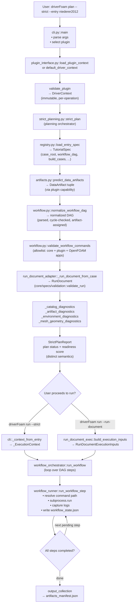
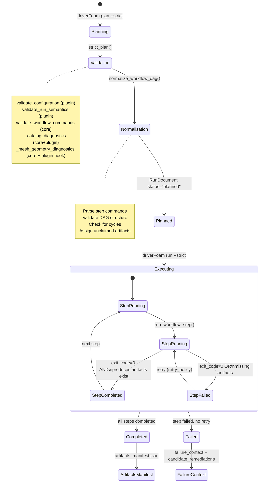
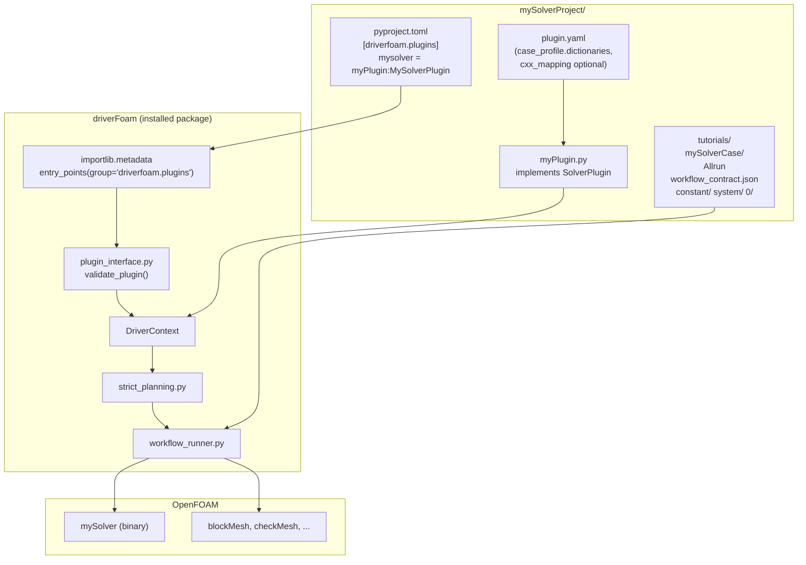
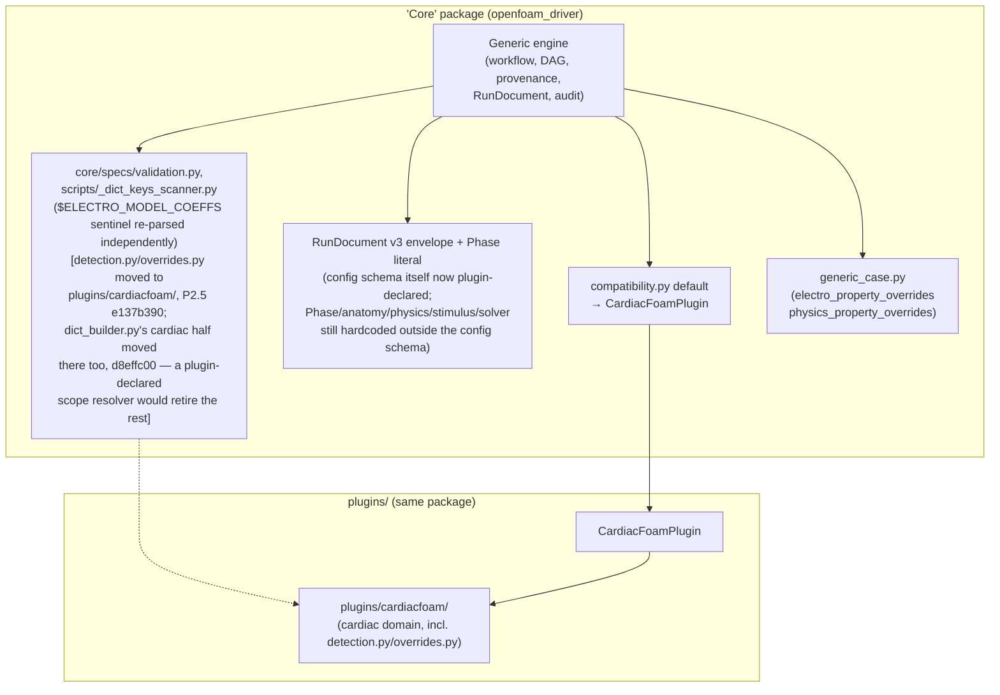
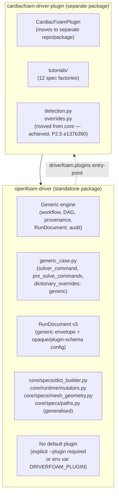

# driverFOAM Architecture and Design Review

> **Review baseline:** branch `ep-work-onto-main`, commit `29ec4f27`, working tree
> inspected on 2026-08-15. The working tree was not clean, so this document
> describes the inspected files rather than claiming to describe the commit
> alone. `ARCHITECTURE.md` itself was untracked when this review began.
>
> **Evidence policy:** implementation and executable tests are primary evidence;
> existing documentation is secondary evidence. Statements labelled **current**
> describe observed behaviour. Statements labelled **target** or **recommended**
> are proposals, not implemented guarantees.

---

## 1. Executive Summary

- **driverFOAM is a structured OpenFOAM orchestration engine**, not just a script runner. It resolves cases, constructs plans, validates selected contracts, executes workflow DAGs, records provenance, and manages parameter sweeps.
- **The plugin boundary (`SolverPlugin` / `DriverContext`) is real, but not yet demonstrated as independently portable.** Entry-point discovery through `driverfoam.plugins` exists and a minimal non-cardiac plugin is tested. A publication-strength claim that an external project can integrate without core changes still needs an out-of-tree reference plugin and end-to-end CI test.
- **Solver agnosticism verdict: PARTIAL — the schema-level blocker is resolved; a narrower seam remains.** The DAG
  executor and much of provenance/state handling are solver-neutral, and as
  of the Phase 2 decoupling plan (`aed4bdc7..1cf64500`, 2026-08-17):
  (1) the `RunDocument` `config` schema is open and per-plugin-validated,
  though the `Phase` Python literal and `core/specs/validation.py`'s phase
  vocabulary are still hardcoded to the cardiac four-phase envelope;
  (2) `core/specs/`'s outright cardiac functions (`detection.py`, `overrides.py`,
  the cardiac half of `dict_builder.py`, `mesh_provisioning.py`,
  `mesh_geometry.py`, `system_templates.py`) have moved into the plugin —
  what's left is `core/specs/apply_overrides.py`'s `$ELECTRO_MODEL_COEFFS`
  sentinel (deferred, tracked) and `core/specs/function_object_fields.py`'s
  hardcoded `"electro"`/`"solid"` region vocabulary (found by the final
  whole-branch review, not yet scoped into a task); (3) compatibility
  defaults in `core/compatibility.py` remain cardiac-shaped by design — this
  is the plan's intentional, P2.5-exempted versioned seam, not a leak;
  (4) `generic_case.py::make_spec`'s vocabulary is resolved (see below);
  (5) audit labels/fallbacks are resolved (`strict_audit.py`,
  `report_catalog.py`, `introspection.py`'s `plugin_catalogs` namespacing).
- **`SolverPlugin` is a project adapter, not merely a solver adapter.** It represents an entire OpenFOAM project integration (tutorials, dictionary catalog, artifact predictions, command authorization, sweep strategy), not a single solver executable. The name understates its scope.
- **`DriverContext` is a well-designed injection container.** It replaced a global mutable plugin state and is correctly scoped per-operation. This is a genuine architectural improvement.
- **The compatibility layer (`core/compatibility.py`) is the clearest record of what still leaks.** Most functions there preserve cardiac-shaped legacy behaviour for optional hooks; they return neutral empty values for every other plugin. It is a migration boundary, not a clean generic abstraction.
- **The canonical `RunDocument` was the most consequential leak; the `config`
  property itself is now fixed.** As of commit `73ca43f7` (P2.2), the core
  JSON schema's `config` property is an open object
  (`additionalProperties: true`) with no fixed phase vocabulary — each plugin
  declares and is validated against its own schema via
  `get_run_document_config_schema()`. What remains cardiac-shaped: the
  built-in `CardiacFoamPlugin`'s own declared schema still requires `anatomy`,
  `physics`, `stimulus`, `solver` and defines `myocardiumSolver` /
  `ionicModel` (by design, for that plugin), and the `Phase` Python literal in
  `core/runtime/run_model.py` and the phase vocabulary in
  `core/specs/validation.py` are still hardcoded to those four names independently
  of the JSON schema.
- **The `core/specs/` module's outright cardiac functions have moved out; a narrower coupling remains.** As of `e137b390` (P2.5), `detection.py` and `overrides.py` — which contain cardiac-specific OpenFOAM dictionary names (`electroProperties`, `physicsProperties`, `myocardiumSolver`, `ionicModel`) — live in `plugins/cardiacfoam/`, not `core/specs/`. `d8effc00` (Task 14) split `core/specs/dict_builder.py` the same way: the cardiac builders (`build_electro_properties`, `build_physics_properties`, `parse_electro_properties`, `build_and_launch`, `_serialize`, `_entry_scope_and_key`) are now `plugins/cardiacfoam/dict_builder.py`, and what remains in `core/specs/dict_builder.py` is solver-neutral. What's left open in `core/specs/` is narrower: the `$ELECTRO_MODEL_COEFFS` sentinel convention is still parsed independently by `core/specs/validation.py` and `scripts/_dict_keys_scanner.py` — retiring those needs a plugin-declared scope resolver, deferred to a follow-up. (`core/specs/apply_overrides.py` itself no longer imports the plugin directly — verified 2026-08-25 while relocating `specs/` into `core/specs/`; it only imports `core/compatibility.py`.)
- **`generic_case.py::make_spec`'s parameter vocabulary was cardiac-shaped; resolved.** As of `242d6338` (P2.6), the "generic" case factory's primary parameters are `dict_file_relpaths`/`dict_file_overrides`, keyed by whatever names a plugin's own dictionaries use — core imposes no fixed key set. `electro_property_overrides`/`physics_property_overrides` survive only as deprecated `**kwargs` aliases for direct callers of core `make_spec` (not the generic path itself), matching P2.6's "deprecated aliases only" criterion; they remain CLI-reachable through unvalidated `--set` splatting, so removing them outright would have silently broken existing agent/CLI usage.
- **The path-discovery logic (`paths.py`) assumes a conventional source-tree layout** by preferring an ancestor containing both `src/` and `tutorials/`. That convention is not uniquely cardiac, but implicit ancestor discovery is fragile for installed packages and external projects.
- **The plugin boundary is not a sandbox.** Discovered plugins execute trusted Python in-process. `Allrun`-family scripts execute case-authored code, and OpenFOAM dictionary values may contain executable directives such as `#codeStream`. The implemented threat model is local, semi-trusted, and single-tenant.
- **“Plan valid,” “ready to execute,” and “scientifically valid” are different states.** In the current implementation an environment-only error leaves `StrictPlanReport.status == "ok"` and the `RunDocument` planned, while `readiness_score.status == "blocked"`; the run path refuses execution. Strict planning checks declared contracts, not the correctness of the equations, discretisation, convergence, or results.
- **Priority work before publication:** decide whether the publication claims a
  cardiacFoam orchestrator or a reusable OpenFOAM orchestrator. For the latter,
  first generalize/version the RunDocument config schema, add an out-of-tree
  non-cardiac conformance fixture, make plan/readiness status semantics
  unambiguous, document the trust boundary prominently, and remove the remaining
  cardiac-shaped compatibility and generic-factory vocabulary.

### 1.1 Claim discipline for the paper and presentation

| Claim | Evidence present now | Defensible wording |
|---|---|---|
| “driverFOAM is solver-independent” | Generic runtime modules, plugin protocol, generic plugin, boundary tests | “The execution core is solver-neutral within OpenFOAM; the complete package remains partially cardiacFoam-coupled.” |
| “Strict planning guarantees a runnable case” | Structural, catalog, workflow, artifact, mesh, and environment diagnostics | “Strict planning detects a defined set of pre-run inconsistencies. Readiness must be checked separately; it does not prove physical correctness.” |
| “Plugins are safe” | Structural interface validation and workflow command validation | “Plugins are trusted in-process extensions. Workflow documents are validated, but case scripts and executable OpenFOAM dictionary directives are not sandboxed.” |
| “A new project requires no core changes” | Entry-point loader and minimal-plugin tests | “The API is designed for no-core-change integration; an out-of-tree reference integration is required to demonstrate this claim.” |
| “Runs are reproducible” | Provenance snapshots, plugin identity/digest, workflow state, artifact manifests | “The system records selected provenance and execution state. Reproducibility still depends on complete dependency capture, environment capture, deterministic solvers, and archived inputs.” |

### 1.2 Choose one publication scope

Both scopes below are legitimate, but mixing them will invite avoidable reviewer
criticism:

| Scope | What can be claimed now | Required framing/work |
|---|---|---|
| **cardiacFoam orchestration system** | A domain-specific, agent-facing planner and workflow executor with explicit cardiac catalogs, validation, provenance, sweeps, and artifacts | Keep RunDocument v3 as cardiac-specific; stop calling the complete package project-agnostic; evaluate cardiac use cases rigorously |
| **Reusable OpenFOAM orchestration platform** | A promising plugin architecture with several generic execution mechanisms | Complete the P0 schema separation and external-plugin conformance work before making the broad claim |

The first scope is narrower but already coherent. The second is architecturally
more ambitious and needs empirical portability evidence, not only interfaces and
dependency diagrams.

---

## 2. What driverFoam Actually Is

driverFoam is a **Python-based OpenFOAM workflow orchestration engine** that sits between an AI agent or CI system and the OpenFOAM solver infrastructure.

Its core job is:

1. **Resolve** which simulation case (tutorial) to run and what configuration to apply.
2. **Plan** a validated, machine-readable execution plan (a `RunDocument`) including the workflow DAG, expected artifacts, and environment requirements.
3. **Execute** the DAG step-by-step, tracking state, capturing logs, and verifying artifact production.
4. **Audit** provenance, declared configuration constraints, workflow readiness,
   and dictionary-catalog coverage. It does not establish physical correctness.
5. **Sweep** across parameter variations of a base case.

Its target design places project-specific knowledge (which dictionaries exist,
which solver commands are authorized, what artifacts a run produces) in a
**plugin**. The current implementation approaches that target but does not yet
meet it completely; Sections 6–8 identify the remaining cardiacFoam coupling.

---

## 3. Current Architecture

### 3.1 Component Map

```
applications/scripts/driverFoam/
│
├── openfoam_driver/                  ← Python package (installable)
│   ├── cli.py                        ← CLI entry point (driverFoam / driverFoam)
│   ├── dict_entries.py               ← Dict-key catalog; PEP 562 lazy shim into
│   │                                    plugins.cardiacfoam, so it stays out of core/
│   ├── sweep_materialize.py          ← materialize_case (public API); `_materialize_case_legacy`
│   │                                    lazily imports plugins.cardiacfoam, so it stays out of core/
│   ├── sweep_routing.py              ← route_case_values (public API); same legacy-import reason
│   │
│   ├── core/                         ← Generic driver engine
│   │   ├── strict_planning.py        ← Planning orchestrator
│   │   ├── introspection.py          ← describe_entry
│   │   ├── planning_types.py         ← StrictDiagnostic, SimulationAuditItem
│   │   ├── capability_manifest.py    ← Build the plan's capability manifest
│   │   ├── plugin_interface.py       ← SolverPlugin (Protocol), DriverContext
│   │   ├── plugin_capabilities.py    ← PluginCapabilities (focused capability bundle)
│   │   ├── plugin_discovery.py       ← Entry-point discovery (driverfoam.plugins group)
│   │   ├── plugin_profile.py         ← PluginProfile, CaseFileRule, CxxMapping (YAML)
│   │   ├── generic_plugin.py         ← GenericOpenFOAMPlugin (no-domain built-in)
│   │   ├── compatibility.py          ← Named Plan-1 cardiac compatibility fallbacks
│   │   ├── report_catalog.py         ← ReportDefinition, applicable_when evaluator
│   │   ├── utility_catalog.py        ← UTILITY_CATALOG, UTILITIES_ROOT
│   │   ├── tutorial_contracts.py     ← describe_tutorial_contract
│   │   ├── tutorials_display.py      ← TutorialDisplay rendering
│   │   ├── sweep/
│   │   │   ├── sweep_derivation_catalog.py ← Sweep axis derivation
│   │   │   └── sweep_expansion.py    ← Sweep case-set expansion
│   │   ├── core/specs/                    ← Shared spec-building utilities
│   │   │   ├── common.py             ← No longer re-exports detection/overrides (removed in P2.5, `e137b390`); still re-exports paths, utils
│   │   │   ├── paths.py              ← repo_root_default, tutorials_root_default, resolve_spec_paths
│   │   │   ├── dict_builder.py       ← Solver-neutral dictionary-synthesis primitives: entry selection, required-field checks, value population, nested OpenFOAM block emission, value tokenisation. Cardiac builders moved to `plugins/cardiacfoam/dict_builder.py` (P2.5, `d8effc00`); no plugin imports and no sentinel parsing remain here
│   │   │   ├── validation.py         ← validate_run (RunDocument validation); independently re-parses the `$ELECTRO_MODEL_COEFFS` sentinel prefix — Task 14
│   │   │   ├── mesh_geometry.py      ← SI-scale polyMesh diagnostic; the purkinjeGraph half moved to `plugins/cardiacfoam/mesh_geometry.py` (P2.5, `ac151ff4`)
│   │   │   ├── mesh_provisioning.py  ← Generic default blockMeshDict render + `cell_counts_from_dx`; the solver-keyed strategy moved to the plugin (P2.5, `efe2c338`)
│   │   │   ├── tet_mesh_provisioning.py ← `render_tet_geo` (gmsh `.geo` `__LC__` substitution)
│   │   │   └── apply_overrides.py    ← --apply override machinery; only imports `core/compatibility.py`, no direct plugin import
│   │   ├── contracts/
│   │   │   ├── dictionary.py         ← DictEntry (generic dictionary entry descriptor)
│   │   │   └── dictionary_catalog.py ← DictionaryCatalog
│   │   └── runtime/                  ← Runtime execution subsystem
│   │       ├── models.py             ← TutorialSpec, CaseConfig, DataArtifact
│   │       ├── workflow.py           ← WorkflowStep, normalize_workflow_dag, validate_workflow_commands
│   │       ├── workflow_state.py     ← WorkflowRunState, WorkflowStepState
│   │       ├── workflow_runner.py    ← run_workflow_step (step executor)
│   │       ├── workflow_orchestrator.py ← run_workflow (full run)
│   │       ├── registry.py           ← Entry resolution, tutorial listing, case discovery
│   │       ├── generic_case.py       ← make_spec / make_generic_case_spec
│   │       ├── run_model.py          ← RunDocument (Python model + JSON schema)
│   │       ├── run_document_exec.py  ← build_execution_inputs (RunDocument → executor)
│   │       ├── run_document_adapter.py ← _run_document_from_case (plan → RunDocument)
│   │       ├── provenance.py         ← Case provenance snapshot
│   │       ├── artifacts.py          ← predict_data_artifacts
│   │       ├── strict_audit.py       ← _build_simulation_audit, readiness_score
│   │       ├── mutators.py           ← Generic OpenFOAM case-file mutation
│   │       ├── sweep_runner.py       ← sweep_plan, sweep_run
│   │       ├── environment_preflight.py ← OpenFOAM environment checks
│   │       └── ...                   ← mutators, output_collection, remediation, etc.
│   │
│   ├── plugins/                      ← Project-specific integrations
│   │   ├── __init__.py
│   │   ├── cardiacfoam_plugin.py     ← CardiacFoamPlugin (SolverPlugin implementation)
│   │   └── cardiacfoam/              ← cardiacFoam domain code
│   │       ├── plugin.yaml           ← Profile: case files, C++ source roots, allowlist
│   │       ├── detection.py          ← detect_myocardium_solver_name, detect_ionic_model_name, etc. (moved from specs/, P2.5, `e137b390`)
│   │       ├── overrides.py          ← apply_electro_property_overrides, apply_physics_property_overrides, `$ELECTRO_MODEL_COEFFS` (moved from specs/, P2.5, `e137b390`)
│   │       ├── dict_builder.py       ← build_electro_properties, build_physics_properties, parse_electro_properties, build_and_launch, `$ELECTRO_MODEL_COEFFS` scope resolution (moved from specs/, P2.5, `d8effc00`)
│   │       ├── dict_entries_catalog.py ← electroProperties entry descriptors
│   │       ├── common_dict_entries.py  ← physicsProperties, controlDict entries
│   │       ├── ionic_model_catalog.py  ← IONIC_MODEL_CATALOG
│   │       ├── active_tension_catalog.py
│   │       ├── solver_coupling.py    ← Solver compatibility rules
│   │       ├── validation.py         ← Cross-field semantic validation
│   │       ├── artifacts_predictor.py ← predict_cardiac_artifacts
│   │       ├── command_authorization.py ← solver_commands, auxiliary_commands, utilities
│   │       ├── case_compatibility.py ← has_case_marker (electroProperties presence)
│   │       ├── case_introspection.py ← resolve_case_models (reads electroProperties)
│   │       ├── case_provenance.py    ← required_inputs, generated_output_globs
│   │       ├── override_schema.py    ← config_schema, dict_entry_catalog
│   │       ├── sweep.py              ← route_case_values, materialize_case
│   │       ├── run_document_config.py ← build_config (cardiac RunDocument shape)
│   │       ├── runtime_evidence.py   ← solve_step_commands, telemetry_source_globs
│   │       ├── planning_policy.py    ← is_nondimensional_case
│   │       ├── mesh_provisioning.py  ← provision_mesh, MESHLESS_SOLVERS/BLOCK_MESH_SOLVERS + the bundled 1-cell polyMesh fixture (moved from specs/, P2.5, `efe2c338`)
│   │       ├── mesh_geometry.py      ← purkinjeGraph SI-scale diagnostics, reached via the `get_mesh_geometry_diagnostics` hook (moved from specs/, P2.5, `ac151ff4`)
│   │       ├── system_templates.py   ← controlDict/fvSchemes/fvSolution baselines per myocardiumSolver (moved from specs/, P2.5, `a1744ba3`)
│   │       └── tutorials/            ← 12+ cardiacFoam tutorial spec factories
│   │           ├── registry.py       ← SPEC_FACTORIES, REGISTERED_TUTORIALS
│   │           ├── single_cell.py
│   │           ├── niederer_2012.py
│   │           └── ...
│   │
│   ├── schemas/
│   │   └── run-document.json         ← JSON Schema v3 (`config` is now an open, plugin-declared object)
│   └── postprocessing/               ← Post-processing task runner
│
├── schemas/run-document.json         ← Canonical hand-authored copy; `openfoam_driver/schemas/run-document.json` is generated from it (P2.8, `schemas/generate_run_document_schema.py`)
└── pyproject.toml                    ← Package metadata, entry-points, scripts
```

### 3.2 High-Level Architecture Diagram

```mermaid
graph TB
    subgraph User["User / Agent / CI"]
        CLI["driverFoam plan|run|step|sweep-run"]
    end

    subgraph Core["Generic Driver Core (openfoam_driver/core/)"]
        PI["plugin_interface.py\n(SolverPlugin Protocol,\nDriverContext, validate_plugin)"]
        PC["plugin_capabilities.py\n(PluginCapabilities bundle\n17 focused seams)"]
        REG["runtime/registry.py\n(Entry resolution,\ntutorial listing,\ncase discovery)"]
        WF["runtime/workflow.py\n(WorkflowStep, DAG\nnormalisation, command\nallowlist)"]
        WFR["runtime/workflow_runner.py\n(Step executor,\nsubprocess launch)"]
        WFO["runtime/workflow_orchestrator.py\n(Full-run loop)"]
        SP["strict_planning.py\n(Plan orchestration,\naudit, diagnostics)"]
        RDE["runtime/run_document_exec.py\n(RunDocument → executor;\nconfig schema is now plugin-declared)"]
        GC["runtime/generic_case.py\n(make_generic_case_spec)"]
        ART["runtime/artifacts.py\n(predict_data_artifacts)"]
        COMPAT["core/compatibility.py\n(Named cardiac fallbacks\nfor Plan 1)"]
    end

    subgraph PluginBoundary["Plugin Boundary (driverfoam.plugins entry-point)"]
        direction TB
        CFP["CardiacFoamPlugin\n(plugins/cardiacfoam_plugin.py)"]
        GOFP["GenericOpenFOAMPlugin\n(core/generic_plugin.py)"]
        THIRDP["ThirdPartyPlugin\n(installed via entry-point)"]
    end

    subgraph CardiacDomain["cardiacFoam Domain (plugins/cardiacfoam/)"]
        DICT["dict_entries_catalog.py\n(electroProperties entries)"]
        ION["ionic_model_catalog.py"]
        TUT["tutorials/\n(12 spec factories)"]
        VAL["validation.py\n(cross-field rules)"]
        CMD["command_authorization.py\n(solver/auxiliary cmds)"]
        ARP["artifacts_predictor.py"]
        CCI["case_introspection.py\n(reads electroProperties)"]
        DET["detection.py\n(detect_myocardium_solver_name\ndetect_ionic_model_name)\n(moved from specs/, P2.5, e137b390)"]
        OVR["overrides.py\n(apply_electro_property_overrides)\n(moved from specs/, P2.5, e137b390)"]
    end

    subgraph SpecsLayer["core/specs/ (narrower cardiac coupling remains)"]
        PAT["paths.py\n(repo_root_default)"]
        AOV["apply_overrides.py\n(only imports core/compatibility.py,\nno direct plugin import)"]
    end

    subgraph OFInfra["OpenFOAM Infrastructure"]
        OFCASE["OpenFOAM Case\n(constant/ system/ 0/)"]
        OFSOLVER["OpenFOAM Solver Binary\n(e.g. cardiacFoam, simpleFoam)"]
        OFUTILS["OpenFOAM Utilities\n(blockMesh, decomposePar, ...)"]
    end

    CLI --> SP
    SP --> PI
    SP --> REG
    SP --> WF
    SP --> ART
    PI --> PC
    PC --> CFP
    PC --> GOFP
    PC --> THIRDP
    REG --> GC
    WF --> WFR
    WFR --> WFO
    CFP --> DICT
    CFP --> ION
    CFP --> TUT
    CFP --> VAL
    CFP --> CMD
    CFP --> ARP
    CFP --> CCI
    CFP --> DET
    CFP --> OVR
    GC --> PAT
    AOV --> DET
    WFR --> OFCASE
    WFR --> OFSOLVER
    WFR --> OFUTILS
    COMPAT -. "fallback for Plan-1 legacy" .-> CFP

    style Core fill:#e8f4f8,stroke:#2196F3
    style PluginBoundary fill:#fff3e0,stroke:#FF9800
    style CardiacDomain fill:#fce4ec,stroke:#E91E63
    style SpecsLayer fill:#ffe0b2,stroke:#FF5722
    style OFInfra fill:#e8f5e9,stroke:#4CAF50
```



---

## 4. Current Causal / Runtime Flow

### 4.1 Step-by-Step Causality (driverFoam plan --strict --entry niederer2012)

**Step 1 — CLI entry**

- `cli.py::main()` parses args; selects plugin from `--plugin` flag.
- With no `--plugin`: calls `default_driver_context()` → `compatibility.py::legacy_default_driver_context()` → instantiates `CardiacFoamPlugin()`.
- With `--plugin none`: calls `generic_openfoam_context()` → `GenericOpenFOAMPlugin()`.
- With `--plugin cardiacfoam`: calls `load_plugin_context("cardiacfoam")` → entry-point discovery.
- Result: an immutable `DriverContext` with `plugin`, `identity`, and lazy `capabilities`.

**Step 2 — Plugin validation**

- `plugin_interface.py::driver_context()` calls `validate_plugin()`: checks all required members exist and are callable, checks `plugin_api_version` is in `{"1","2"}`, enforces v2 member list if `api_version="2"`.
- `get_profile()` is called; profile `plugin_id` and `api_version` are cross-checked against the plugin object.
- `get_dict_entries()` is called; entries are checked for duplicate `driver_path` values.
- Result: validated `DriverContext` with stable `PluginIdentity`.

**Step 3 — Entry resolution (`strict_plan`)**

- `strict_planning.py::strict_plan()` calls `load_entry_spec(entry, driver_context=ctx)`.
- `registry.py::load_entry_spec()` → `resolve_entry()`:
  - Tries to match `name` against `_normalized_registry(driver_context)` — the plugin's `get_tutorial_catalog()["spec_factories"]`.
  - If found as registered tutorial: calls the matching `make_spec()` factory (e.g. `make_niederer_2012_spec(tutorials_root=...)`).
  - If found as case folder on disk: calls either the plugin's `make_generic_case_spec` or core's `make_generic_case_spec` depending on whether the case has a cardiac marker (`electroProperties` file).
- Result: a `TutorialSpec` (frozen dataclass with `name`, `case_root`, `setup_root`, `output_dir`, `build_cases`, `apply_case`, `run_case`, `metadata`).

**Step 4 — Artifact prediction**

- `artifacts.py::predict_data_artifacts()` calls `driver_context.capabilities.artifacts.predict(...)`.
- For cardiacFoam: dispatches to `artifacts_predictor.py::predict_cardiac_artifacts()`, which reads `electroProperties` on-disk and predicts ECG CSV, VTK sequences, etc.
- Result: `tuple[DataArtifact, ...]`.

**Step 5 — Workflow DAG normalisation**

- `workflow.py::normalize_workflow_dag()` is called with the raw DAG from `spec.metadata["workflow_dag"]`.
- Parses and validates steps; checks for duplicate IDs, self-dependencies, cycles.
- Assigns unclaimed artifacts to the last solver step via `driver_context.capabilities.command_authorization.solver_commands()`.
- Result: normalized DAG dict + `tuple[WorkflowDiagnostic, ...]`.

**Step 6 — Command allowlist validation**

- `workflow.py::validate_workflow_commands()` checks each step's command is in: `CORE_NEUTRAL_COMMANDS` (blockMesh, checkMesh, …) ∪ plugin solver commands ∪ plugin auxiliary commands ∪ case scripts ∪ installed OpenFOAM apps (via `$FOAM_APPBIN`).
- Any unknown command → `WorkflowDiagnostic(level="error", code="unknown_workflow_command")`.

**Step 7 — RunDocument construction**

- `run_document_adapter.py::_run_document_from_case()` builds a `RunDocument` dataclass.
- Calls `driver_context.capabilities.run_document_configuration.build(...)` → `cardiacfoam/run_document_config.py::build_config()` for cardiac, or generic empty sections for others.
- Also calls `core/specs/validation.py::validate_run()` for semantic validation of the run config.

**Step 8 — Plan diagnostics and readiness assembly**

- Catalog diagnostics: `_catalog_diagnostics()` — checks C++ source dictionary keys against `DictEntry.driver_path` values.
- Artifact diagnostics: `_artifact_diagnostics()` — calls plugin `validate_configuration()`, then `validate_workflow_commands()`.
- Environment diagnostics: checks OpenFOAM is sourced, required executables exist.
- Mesh geometry diagnostics: SI-scale check of `blockMeshDict`.
- All are assembled into `StrictPlanReport`, but they do **not** all control the
  same status. Environment diagnostics affect the audit/readiness score but are
  intentionally excluded from `plan_diagnostics`; therefore an environment-only
  error can produce `report.status == "ok"` together with
  `readiness_score.status == "blocked"`. The CLI run path separately refuses
  execution when environment errors are present.
- Consequence: consumers must not interpret `status == "ok"` alone as “safe to
  launch.” For the current schema, launchability requires both a non-failed plan
  and a non-blocked readiness result (plus the run-path ingestion checks).

**Step 9 — Execution (driverFoam run --strict --entry niederer2012)**

- CLI reads `report.workflow_dag`, `report.workflow_state`, `report.case_root`, `report.expected_artifacts` from the plan.
- Calls `_execute_run()` → `workflow_orchestrator.py::run_workflow()`.
- Orchestrator iterates: finds next pending step → calls `workflow_runner.py::run_workflow_step()`.
- Runner resolves command paths (`Allrun`-family scripts may resolve inside the
  case; bare binaries resolve through `PATH`), launches an argv-style subprocess
  without a shell, writes stdout/stderr to per-attempt log files, updates
  `WorkflowRunState`, and writes `workflow_state.json` atomically.
- After each step: checks `produces` artifacts exist; if missing, marks step failed.

**Step 10 — Artifacts manifest**

- On run completion, `output_collection.py` collects outputs and writes `artifacts_manifest.json`.

### 4.2 Diagram A — Runtime Causal Flow



### 4.3 Diagram B — Architecture / Dependency Boundaries

```mermaid
graph LR
    subgraph CardiacTutorials["D: Tutorial Layer\n(plugins/cardiacfoam/tutorials/)"]
        T1["niederer_2012.py\nmake_spec()"]
        T2["single_cell.py"]
        T3["...12 tutorial factories"]
    end

    subgraph CardiacDomain["C: Project Adapter\n(plugins/cardiacfoam/)"]
        CP["CardiacFoamPlugin"]
        CATS["dict_entries_catalog\nionic_model_catalog\nactive_tension_catalog"]
        VALID["validation.py\nartifacts_predictor.py\ncase_introspection.py"]
        CMD["command_authorization.py"]
        DET["detection.py\noverrides.py\n(moved from specs/, P2.5, e137b390)"]
    end

    subgraph OFLayer["B: OpenFOAM Infrastructure\n(core/specs/ + runtime/environment)"]
        DICT["core/specs/dict_builder.py\ncore/runtime/mutators.py"]
        ENV["environment_preflight.py\nopenfoam_environment.py"]
        MESH["mesh_geometry.py\n(polyMesh regions only)"]
        PATHS["paths.py (partially contaminated)"]
        AOV["apply_overrides.py\n($ELECTRO_MODEL_COEFFS sentinel\nstill parsed independently in\nvalidation.py and\nscripts/_dict_keys_scanner.py;\napply_overrides delegates the parse\nto plugins/cardiacfoam/dict_builder.py)"]
    end

    subgraph GenCore["A: Generic Driver Core\n(core/ + strict_planning.py)"]
        PI["plugin_interface.py\nSolverPlugin / DriverContext"]
        PC["plugin_capabilities.py\nPluginCapabilities"]
        WF["workflow.py"]
        WFR["workflow_runner.py"]
        REG["registry.py"]
        RDE["run_document_exec.py"]
        SP["strict_planning.py"]
    end

    subgraph OFCase["OpenFOAM Case on Disk"]
        CASE["constant/ system/ 0/\nAllrun workflow_contract.json"]
    end

    subgraph OFBins["OpenFOAM Binaries"]
        SOLV["cardiacFoam\nsimpleFoam\nblockMesh ..."]
    end

    CardiacTutorials --> CardiacDomain
    CardiacDomain --> OFLayer
    OFLayer --> GenCore
    GenCore --> OFCase
    GenCore --> OFBins

    GenCore -. "COMPAT LEAK\ncompatibility.py defaults to\nCardiacFoamPlugin" .-> CardiacDomain
    OFLayer -. "REMAINING COUPLING (P2.5, e137b390)\n$ELECTRO_MODEL_COEFFS sentinel convention\n+ explicit plugin import in apply_overrides.py\n(detection.py/overrides.py themselves\nalready moved to CardiacDomain)" .-> CardiacDomain
```



### 4.4 Diagram C — Workflow Lifecycle



### 4.5 Diagram D — Plugin Integration (New Repository)



### 4.6 Trust Boundary for Agent-Authored Runs

The architecture has two different extension surfaces and they must not be
confused:

1. A **plugin** is trusted Python code. Loading either an installed entry point
   or a `module:Class` target imports and executes code inside the driver
   process. `validate_plugin()` checks shape and identity; it does not isolate or
   sandbox the plugin.
2. A **RunDocument** is semi-trusted data. The public ingestion path validates
   its schema and config, re-normalizes its DAG, checks commands, canonicalizes
   launch paths, and optionally confines case/output paths under
   `DRIVERFOAM_ALLOWED_RUNS_ROOT`.

The command boundary provides useful but limited controls:

- workflow steps use argv-style execution without a shell;
- a step `cwd` must resolve inside `caseRoot`;
- arbitrary absolute commands and arbitrary `./script` commands are rejected;
- bare commands resolve through the trusted ambient `PATH`;
- `Allrun`-family scripts are allowed to execute from the case;
- executables installed under `$FOAM_APPBIN` or `$FOAM_USER_APPBIN` are accepted.

This is **not arbitrary-code containment**. An allowed `Allrun` script may run
arbitrary commands. Values written to OpenFOAM dictionaries may contain
executable directives or coded function objects. There are no resource limits
for CPU time, memory, process count, or output size. Direct Python calls to the
low-level runner bypass the public ingestion checks. The accurate threat-model
statement is therefore:

> driverFOAM validates semi-trusted orchestration documents on a trusted,
> single-tenant host; it does not sandbox untrusted plugins, cases, OpenFOAM
> dictionaries, binaries, or environments.

For publication, this statement should be cited to `SECURITY.md` and tested as a
contract. Multi-tenant or adversarial execution would require an external
containment layer (for example, a locked-down container/job runner, read-only
inputs, bounded resources, restricted networking, and a curated executable
environment); it cannot be obtained by extending the Python allowlist alone.

### 4.7 Scientific Assurance Boundary

The strict planner is a pre-flight consistency checker, not a numerical or
scientific verifier. It can detect only properties encoded in its catalogs,
plugin validators, workflow contracts, filesystem checks, and environment
checks. At present it can support claims such as:

- required case files and selected dictionary entries were found;
- known solver/model combinations satisfy encoded compatibility rules;
- the workflow DAG is structurally valid and uses accepted commands;
- predicted required artifacts are assigned and checked for existence;
- selected provenance inputs and runtime dependencies were recorded;
- basic mesh-scale heuristics did not trigger an encoded diagnostic.

It does **not** by itself demonstrate:

- dimensional consistency of every equation and dictionary value;
- appropriate spatial/temporal discretisation or mesh independence;
- convergence, stability, conservation, or solver tolerance adequacy;
- correctness/completeness of the C++ model implementation;
- validation against analytical, manufactured, benchmark, or experimental data;
- deterministic reproducibility across compilers, OpenFOAM versions, hardware,
  MPI layouts, or dependency changes;
- semantic safety of arbitrary dictionary text written by an agent.

For publication, connect driverFOAM to a verification ladder: unit/contract
tests → manufactured-solution or benchmark tests → mesh/time convergence →
regression equivalence → experiment-specific validation. Report these as
separate evidence classes rather than folding all of them into one readiness
score.

---

## 5. Current Naming Review

| Current name | What it actually represents | Name accurate? | Suggested name | Reason |
|---|---|---|---|---|
| `driverFoam` | A Python package + CLI that orchestrates OpenFOAM project workflows | Partially — "Foam" is narrow | `foam-orchestrator` or keep `driverFoam` | The name is recognisable; changing it would break existing references. Keep it, but clarify in docs. |
| `openfoam_driver` | Python package name | Fine | — | Matches the OpenFOAM domain accurately |
| `SolverPlugin` | An entire OpenFOAM **project** integration (tutorials, dictionaries, commands, artifacts, validation) | **No** — it is a project adapter, not a solver adapter | `ProjectPlugin`, `ProjectAdapter`, `ProjectIntegration` | A "solver" is a single executable. This contract covers an entire project's vocabulary. |
| `DriverContext` | Immutable per-operation bundle of plugin + identity + capabilities | Yes | — | Accurately conveys it carries context for one driver operation |
| `PluginCapabilities` | Focused set of typed seams wrapping a `SolverPlugin` | Good | — | Correctly named; "capabilities" reflects the seam-based design |
| `TutorialSpec` | A complete case execution specification (case root, I/O paths, build/apply/run callbacks) | Misleading — it is not only for "tutorials" | `CaseSpec`, `ExecutionSpec`, `CaseExecutionSpec` | Any filesystem case folder resolves to this, not just registered tutorials |
| `CaseConfig` | One parameterised variant within a sweep | Acceptable | `CaseVariant`, `SweepCaseParams` | "Config" implies configuration file; it's actually a parameter bundle for one sweep point |
| `RunDocument` | The machine-readable plan + execution state document for one case run | Name is good; the v3 envelope is generic, the built-in plugin's config shape is not | Keep name; version schema | The envelope is well named; the cardiac config vocabulary now lives in the plugin's own declared schema |
| `workflow_dag` | The executable DAG of steps | Good | — | Standard terminology |
| `StrictPlanReport` | The output of the strict planner: diagnostics, DAG, artifacts, audit | Good | — | Accurately describes the full planning output |
| `make_spec` | Factory function producing a `TutorialSpec` | Misleading | `make_case_spec` | No longer "spec" in the sense of specification document; it's a case execution spec |
| `generic_case.py` | Core module for arbitrary OpenFOAM case-folder execution | Acceptable | `case_factory.py` | "generic" is clear but `case_factory` is more descriptive |
| `compatibility.py` | Named Plan-1 cardiac fallbacks | Good | — | Clear intent; Plan 2 seams are documented |
| `CapabilityManifest` (Protocol) | Opaque object returned by `get_capabilities()` — solver/project capabilities for the plan | Vague | `ProjectCapabilitiesManifest` | Should clarify it is the project's capability surface |
| `CORE_NEUTRAL_COMMANDS` | OpenFOAM utilities always allowed regardless of plugin | Good | — | Accurately named; "neutral" = neither solver nor case-script |
| `detect_myocardium_solver_name` | Parse `electroProperties` for `myocardiumSolver` value | **Project-specific** — **moved out of `core/specs/` (P2.5, `e137b390`)** | Now `plugins/cardiacfoam/detection.py` | This is a cardiacFoam dictionary key, not a generic OpenFOAM concept; see §6's `plugins/cardiacfoam/detection.py` rows |
| `apply_electro_property_overrides` | Write overrides into `electroProperties` | **Project-specific** — **moved out of `core/specs/` (P2.5, `e137b390`)** | Now `plugins/cardiacfoam/overrides.py` | `electroProperties` is a cardiacFoam dictionary name; see §6's `plugins/cardiacfoam/overrides.py` rows. The `$ELECTRO_MODEL_COEFFS` sentinel convention it carries is only *partially* retired — still re-parsed by `core/specs/validation.py` and `scripts/_dict_keys_scanner.py` |
| `repo_root_default` | Navigate upward looking for `src/` + `tutorials/` | Convention-dependent | Prefer explicit roots | The layout is common but not reliable for installed, nested, or differently structured projects |

### 5.1 Recommended Final Vocabulary

| Concept | Recommended term |
|---|---|
| The orchestration engine | driverFoam (keep) |
| The Python package | `openfoam_driver` (keep) |
| The project integration contract | `ProjectPlugin` (rename from `SolverPlugin`) |
| The per-operation dependency bundle | `DriverContext` (keep) |
| The focused capability seams | `PluginCapabilities` (keep) |
| One case execution specification | `CaseSpec` (rename from `TutorialSpec`) |
| One parameterised sweep point | `CaseVariant` (rename from `CaseConfig`) |
| The execution plan document | `RunDocument` (keep) |
| The planning output report | `StrictPlanReport` (keep) |
| A registered workflow entry | "entry" (keep) |
| A case folder on disk | "case folder" (keep) |

---

## 6. Solver Agnosticism Audit

### Verdict: **PARTIALLY SOLVER-AGNOSTIC**

More precisely:

- **Solver-agnostic mechanisms (within OpenFOAM):** DAG normalization, subprocess execution, workflow state, retry orchestration, and command validation are largely solver-neutral.
- **Solver-agnostic data model:** Partial. The core v3 `RunDocument` JSON schema's `config` property is now an open, plugin-declared object (P2.2, commit `73ca43f7`); `core/specs/validation.py`'s phase vocabulary and the `Phase` literal in `core/runtime/run_model.py` still encode cardiac phases and fields independently of that schema, and the built-in `CardiacFoamPlugin` still declares a cardiac-shaped config schema for itself (by design).
- **OpenFOAM-agnostic:** The engine is not agnostic to OpenFOAM. It assumes the `$FOAM_APPBIN` / `$FOAM_USER_APPBIN` environment, OpenFOAM dictionary text format, Allrun/Allclean script conventions, and `constant/ system/ 0/` case layout.
- **Project-agnostic:** NOT YET. Several modules assume cardiacFoam's dictionary vocabulary.

### Classification Table

| File | Element | Classification | Violates solver agnosticism? | Should stay in core? | Where instead? |
|---|---|---|---|---|---|
| `core/plugin_interface.py` | `SolverPlugin` Protocol | A — Generic core | No | Yes | Keep, rename to `ProjectPlugin` |
| `core/plugin_interface.py` | `DriverContext` | A — Generic core | No | Yes | Keep |
| `core/plugin_interface.py` | `default_driver_context()` | E — Legacy compat | **Yes** — defaults to cardiacFoam | Needs attention | Either remove default or make it configurable via env var |
| `core/compatibility.py` | Legacy default/mutation/case/sweep/config fallbacks; v1 adapters | E — Legacy compat (named) | Mostly; some non-cardiac v1 branches return neutral empty values | Boundary only | It exposes migration debt clearly but still routes several optional hooks through cardiac implementations |
| `core/runtime/workflow.py` | `CORE_NEUTRAL_COMMANDS` | B — OpenFOAM-specific | No (OpenFOAM, not cardiac) | Yes | Keep |
| `core/runtime/workflow.py` | `CASE_SCRIPT_COMMANDS` | B — OpenFOAM-specific | No | Yes | Keep |
| `schemas/run-document.json` | Required config phases and `physicsSlice` | C — Project-specific | **Resolved (P2.2, `73ca43f7`)** | Now generic — `config` is `{"type": "object", "additionalProperties": true}`; `physicsSlice` moved to `plugins/cardiacfoam/config_schema.py` | Done; a generic v3 document (dropping v2 compatibility affordances) is still a separate, unstarted item |
| `core/runtime/run_model.py` | `Phase = Literal["anatomy", "physics", "stimulus", "solver"]` | C — Project-specific | **Yes** | Not in its current form | Derive phases from the plugin or model config as an opaque mapping |
| `core/specs/validation.py` | Fixed phase order and cardiac catalog validation | C — Project-specific | **Yes** | Split | Keep generic document validation in core; move cardiac config semantics to the plugin |
| `core/runtime/generic_case.py` | ~~`make_spec()` parameters: `electro_property_overrides`, `physics_property_overrides`, `electro_properties_relpath`, `physics_properties_relpath`~~ Resolved (P2.6) | C — Project-specific | **Resolved (P2.6)** | Now generic — `dict_file_relpaths` / `dict_file_overrides`, mappings keyed by whatever names a plugin gives its own dictionaries; core imposes no key set | Done; the four historical names survive only as deprecated aliases translated by `core/compatibility.py::legacy_generic_case_dict_file_aliases()`, and the historical default paths by `legacy_generic_case_dict_file_relpaths()` |
| `core/runtime/generic_case.py` | `_apply_case_mutation` fallback → `legacy_generic_case_mutation` | E — Legacy compat | **Yes** | No | Should be an optional plugin-provided mutation callback |
| `core/runtime/registry.py` | `_is_case_directory` — falls back to plugin's `has_case_marker` | A — Generic core (uses plugin) | No | Yes | Plugin owns the marker logic correctly |
| `core/runtime/registry.py` | `resolve_entry` using `has_case_marker` to choose `make_generic_case_spec` vs plugin's | A — Acceptable | Mild | Yes | Logic is correct but the comment "cardiac case-folder semantics" reveals the intent |
| `plugins/cardiacfoam/detection.py` | `detect_myocardium_solver_name` | C — Project-specific | No — **resolved (P2.5, `e137b390`)** | No (correct location) | Moved from `specs/detection.py`; correctly in `plugins/cardiacfoam/` |
| `plugins/cardiacfoam/detection.py` | `detect_ionic_model_name` | C — Project-specific | No — **resolved (P2.5, `e137b390`)** | No (correct location) | Same |
| `plugins/cardiacfoam/detection.py` | `detect_ionic_export_list`, `detect_active_tension_model_name` | C — Project-specific | No — **resolved (P2.5, `e137b390`)** | No (correct location) | Same |
| `plugins/cardiacfoam/overrides.py` | `apply_electro_property_overrides` | C — Project-specific | No — **resolved (P2.5, `e137b390`)** | No (correct location) | Moved from `specs/overrides.py`; `electroProperties` is cardiacFoam-specific |
| `plugins/cardiacfoam/overrides.py` | `apply_physics_property_overrides` | C — Project-specific | No — **resolved (P2.5, `e137b390`)** | No (correct location) | Moved from `specs/overrides.py`; `physicsProperties` is cardiacFoam-specific |
| `plugins/cardiacfoam/overrides.py` | `$ELECTRO_MODEL_COEFFS` scope token | C — Project-specific | **Partially resolved (P2.5)** — the constant lives in the plugin and `core/specs/dict_builder.py`'s copy travelled with `_serialize`/`_entry_scope_and_key` into `plugins/cardiacfoam/dict_builder.py` (`d8effc00`), but the sentinel *convention* is still parsed independently in `core/specs/validation.py` and `scripts/_dict_keys_scanner.py` | Not yet — split across two core parsers | This sentinel still names a cardiac concept from two core sites; full retirement needs a plugin-declared scope resolver |
| `core/specs/paths.py` | `repo_root_default` — looks for `src/` + `tutorials/` | B/C — Layout convention | Not inherently, but fragile | Partially | Prefer explicit configured/package-resource roots over ancestor guessing |
| `core/specs/dict_builder.py`, `core/runtime/mutators.py` | OpenFOAM text dictionary manipulation | B — OpenFOAM-specific | No | Yes | Correctly shared; not cardiac-specific |
| `core/runtime/strict_audit.py` | ~~Success text naming `physicsProperties` and `electroProperties`~~ | C — Project-specific presentation | No — **Resolved (P2.7, `80d83c88`)** | Yes (text is now plugin-sourced) | Done; the audit summary wording comes from the plugin, so core names no cardiac dictionary |
| `plugins/cardiacfoam_plugin.py` | `CardiacFoamPlugin` | C — Project adapter | — | No (correct location) | Correctly in plugins/ |
| `plugins/cardiacfoam/validation.py` | `_evaluate_solver_coupling`, `_evaluate_heterogeneity` | C — Project-specific | — | No (correct location) | Correctly in plugins/ |
| `plugins/cardiacfoam/tutorials/*` | 12 tutorial spec factories | D — Tutorial-specific | — | No (correct location) | Correctly in plugins/ |
| `strict_planning.py` | ~~`function_object_diagnostics` using `samplable_fields: {"electro": [], "solid": []}`~~ | C — Mild leak | No — **Resolved (P2.5, `4f3cd7a8`)** | Yes | Done; the fallback is gone — `samplable` comes from the plugin's capability manifest with an empty-mapping default that names no regions |
| `pyproject.toml` | `name = "cardiacfoam-tutorials-driver"` | C — Project-specific | Naming only | Rename for reuse | Should be `openfoam-driver` or `driverfoam` |
| `pyproject.toml` | `[driverfoam.plugins]\ncardiacfoam = ...CardiacFoamPlugin` | C — Project-specific | No (correct use of mechanism) | This is correct | The mechanism is right; the bundling with the core is the issue |

### 6.1 The Three Agnosticism Levels Disentangled

| Level | Current status |
|---|---|
| **Solver-command agnostic** (one executable) | ✅ Mostly — solver commands are plugin-provided; comments and examples still mention `cardiacFoam` |
| **Project-agnostic data model** (one OpenFOAM project) | ⚠️ Partial — the canonical RunDocument JSON schema's `config` property is now open and plugin-declared (P2.2), but the `Phase` literal, `core/specs/validation.py`'s phase vocabulary, `core/specs/`, the legacy generic factory, audit labels, and compatibility defaults remain cardiac-shaped |
| **OpenFOAM-agnostic** | ❌ No (by design) — the engine requires OpenFOAM environment, dictionary format, Allrun convention, case layout |

---

## 7. Dependency / Coupling Audit

### Important project-specific dependencies in supposedly generic code

| Location | Dependency | Why it exists | Severity |
|---|---|---|---|
| `core/plugin_interface.py::default_driver_context()` | Imports `CardiacFoamPlugin` | Historical default — no plugin selection used to mean cardiacFoam | **Architectural smell** — creates implicit cardiacFoam coupling at the entry point |
| `core/compatibility.py::legacy_default_driver_context()` | Instantiates `CardiacFoamPlugin` | Named Plan-1 compat boundary | **Acceptable for now** — documented and named |
| `core/compatibility.py::legacy_resolve_case_models()` | Branches on `plugin_id == "org.cardiacfoam"` | Only the built-in cardiac plugin implements this optional hook directly | **Architectural smell** — hardcodes `org.cardiacfoam` as special |
| `core/compatibility.py::legacy_solver_commands()` | Same branch on `plugin_id == "org.cardiacfoam"` | Same reason | **Architectural smell** |
| `core/runtime/generic_case.py::make_spec()` | ~~Parameters `electro_property_overrides`, `physics_property_overrides`, `electro_properties_relpath`, `physics_properties_relpath`~~ Resolved (P2.6) — the signature now takes `dict_file_relpaths` / `dict_file_overrides`, and `TutorialSpec.metadata` carries `dict_file_relpaths` / `has_default_dict_file_overrides` | Historical: generic factory was originally the cardiac factory | **Resolved** — the cardiac names remain only as deprecated aliases and default values sourced from the named `core/compatibility.py` seam |
| `core/runtime/generic_case.py::make_spec()` | `_apply_case_mutation` fallback to `legacy_generic_case_mutation` | Must preserve cardiac apply-case behaviour for existing callers | **Architectural smell** — generic case factory has a cardiac default |
| `schemas/run-document.json` | ~~Required cardiac config phases and cardiac physics fields~~ Resolved (P2.2, `73ca43f7`) — `config` is now `{"type": "object", "additionalProperties": true}`, validated per-plugin via `get_run_document_config_schema()` | The v2 RunDocument originated as the cardiac agent contract (v3 since P2.3, `fc2ec652`) | **Resolved for the schema** — a plugin builds and declares its own config shape; `core/runtime/run_model.py`'s `Phase` literal is a separate, still-open item (see next row) |
| `core/runtime/run_model.py` | `Phase = Literal["anatomy", "physics", "stimulus", "solver"]` | Independent of the JSON schema; used by `core/specs/validation.py` and elsewhere | **Extraction blocker** — a plugin can build and schema-validate its own config, but the `Phase` type itself is still project-specific |
| `core/specs/validation.py` | Fixed phase vocabulary and plugin-catalog checks applied to the RunDocument (cardiac-shaped for the built-in plugin, but plugin schemas are now independently declared) | Validates RunDocument config and semantic constraints | **Extraction blocker** — generic schema validation and cardiac semantic validation are not separated cleanly |
| `plugins/cardiacfoam/detection.py` | Entire module — `detect_myocardium_solver_name`, `detect_ionic_model_name`, `electro_properties_has_block`, `detect_active_tension_model_name` | Moved out of `core/specs/` into the plugin (P2.5, `e137b390`); used by cardiacFoam tutorial factories | **Resolved** — no longer cardiac code in the shared `core/specs/` layer. `core/specs/apply_overrides.py` no longer imports this module directly (verified 2026-08-25); `core/specs/dict_builder.py`'s import went away when its cardiac half moved to the plugin (`d8effc00`) |
| `plugins/cardiacfoam/overrides.py` | `apply_electro_property_overrides`, `apply_physics_property_overrides`, `$ELECTRO_MODEL_COEFFS` | Moved out of `core/specs/` into the plugin (P2.5, `e137b390`); cardiac-specific mutation helpers used by tutorial spec factories | **Resolved for the module itself.** The `$ELECTRO_MODEL_COEFFS` sentinel *convention*, however, is still independently re-parsed in `core/specs/validation.py` and `scripts/_dict_keys_scanner.py` — **actual coupling remains** (the third site, `core/specs/dict_builder.py`, moved into the plugin with `d8effc00`) |
| `core/specs/paths.py::repo_root_default()` | Looks for `src/` + `tutorials/` to detect a source tree | Convenient repository checkout discovery | **Deployment smell** — a convention-based ancestor search is ambiguous for installed or nested projects |
| `strict_planning.py` | `function_object_field_diagnostics` fallback `{"electro": [], "solid": []}` | The `electro`/`solid` region names come from cardiacFoam's multi-region solver architecture | **Mild leak** — only affects the fallback, not the main path |
| `core/runtime/strict_audit.py` | Passed-stage summary names cardiac dictionary files | Historical report wording | **Presentation leak** — generated audit text can misdescribe a non-cardiac plugin |
| `pyproject.toml` | Package name `cardiacfoam-tutorials-driver` | Original naming | **Naming smell** — not a blocker, but signals the package is project-specific |
| `pyproject.toml` | Bundles `CardiacFoamPlugin` as default entry-point | Convenience for cardiacFoam users | **Acceptable** — correctly uses the entry-point mechanism, but bundles project code with core |

---

## 8. Current vs Target Architecture

### Current



### Target



### Delta: Current → Target

| Difference | Status | Priority |
|---|---|---|
| Canonical RunDocument `config` schema is cardiac-shaped | **Partially solved (P2.2, `73ca43f7`)** — `config` property is now open/plugin-declared; the `Phase` literal and `core/specs/validation.py` vocabulary are still cardiac-shaped | P0 |
| `core/specs/detection.py` cardiac functions in shared layer | **Resolved (P2.5, `e137b390`)** — moved verbatim to `plugins/cardiacfoam/detection.py` | ✅ Done |
| `core/specs/overrides.py` cardiac functions in shared layer | **Resolved (P2.5, `e137b390`)** — moved verbatim to `plugins/cardiacfoam/overrides.py`. The `$ELECTRO_MODEL_COEFFS` sentinel *convention* itself remains split across `core/specs/validation.py` and `scripts/_dict_keys_scanner.py` — that residual coupling is deferred to a plugin-declared scope resolver | P1 (residual sentinel only) |
| `generic_case.py::make_spec()` has cardiac parameter names | **Missing** — not generalised | P0 |
| `default_driver_context()` defaults to cardiacFoam | **Missing** — needs explicit-or-env default | P1 |
| `compatibility.py` hardcodes `plugin_id == "org.cardiacfoam"` | **Partially solved** — named boundary exists, but coupling remains | P1 |
| Plugin contract (`SolverPlugin`) | **Already solved** — protocol + validation exists | ✅ Done |
| Entry-point discovery (`driverfoam.plugins`) | **Already solved** | ✅ Done |
| `DriverContext` per-operation scoping | **Already solved** — replaced global state | ✅ Done |
| `PluginCapabilities` focused seams | **Already solved** | ✅ Done |
| `GenericOpenFOAMPlugin` built-in | **Already solved** | ✅ Done |
| `plugin.yaml` profile mechanism | **Already solved** | ✅ Done |
| `compatibility.py` as named boundary | **Partially solved** — leaks documented, not yet removed | P1 |
| `strict_planning.py` `electro`/`solid` fallback region names | **Partially solved** — only in fallback | P2 |
| Package name `cardiacfoam-tutorials-driver` | **Missing** — needs rename | P2 |
| `paths.py::repo_root_default()` bias toward cardiacFoam layout | **Missing** | P1 |

---

## 9. Plugin / Adapter Boundary

### What belongs on each side

**Inside the generic core (stays unchanged for any project):**

- The `SolverPlugin` / `ProjectPlugin` Protocol and validation
- `DriverContext` construction and caching
- `PluginCapabilities` adapter bundle and all 17 focused seam protocols
- `plugin_discovery.py` entry-point loading
- `plugin_profile.py` YAML profile loading
- `workflow.py` — DAG normalisation, command allowlist, step model
- `workflow_runner.py` — subprocess execution, log capture, state management
- `workflow_orchestrator.py` — retry logic, DAG traversal
- `registry.py` — entry resolution, case folder discovery (using plugin seams)
- The generic RunDocument **envelope** (identity, launch, workflow, state,
  artifacts, validation). The `config` property is now delegated to
  per-plugin schemas (P2.2, `73ca43f7`); the `Phase` literal and
  `core/specs/validation.py`'s phase vocabulary are still project-specific and
  must be generalized before the whole document can be listed here.
- `run_document_exec.py` — RunDocument → executor
- `strict_planning.py` — planning orchestration
- `artifacts.py`, `provenance.py`, `strict_audit.py`
- `core/specs/dict_builder.py`, `core/runtime/mutators.py` — OpenFOAM text manipulation (genuinely generic)
- `core/specs/mesh_geometry.py` — SI-scale polyMesh diagnostic (OpenFOAM-specific but not cardiac); plugins add their own point-set checks through `get_mesh_geometry_diagnostics`
- `core/specs/mesh_provisioning.py`, `core/specs/tet_mesh_provisioning.py` — generic default blockMeshDict / gmsh `.geo` rendering

**Inside the project adapter (must be provided by each project):**

- `get_dict_entries()` — the project's dictionary entry descriptors
- `get_capabilities()` — solver/model catalog for the plan
- `get_tutorial_catalog()` — registered tutorial spec factories
- `validate_configuration(spec)` — domain-specific validation
- `validate_run_semantics(context)` — cross-field semantic rules
- `predict_data_artifacts(case_root, spec)` — artifact prediction
- `get_solver_commands()` / `get_auxiliary_commands()` — command authorization
- `has_case_marker(case_root)` — case discovery signal
- `resolve_case_models(case_root)` — model introspection
- Tutorial-specific `make_spec()` factories

**Should move from "generic" to the project adapter:**

- Cardiac configuration phases/fields from `schemas/run-document.json`,
  `core/runtime/run_model.py`, and `core/specs/validation.py` (or expose them through
  a plugin-owned schema extension while keeping a generic envelope)
- ~~`core/specs/detection.py` — `detect_myocardium_solver_name`, `detect_ionic_model_name`, etc.~~ **Done (P2.5, `e137b390`)** — now `plugins/cardiacfoam/detection.py`
- ~~`core/specs/overrides.py` — `apply_electro_property_overrides`, `apply_physics_property_overrides`~~ **Done (P2.5, `e137b390`)** — now `plugins/cardiacfoam/overrides.py`; the `$ELECTRO_MODEL_COEFFS` sentinel convention still needs retiring from `core/specs/validation.py` and `scripts/_dict_keys_scanner.py`
- `generic_case.py` parameters `electro_property_overrides` / `physics_property_overrides`
- The default context in `compatibility.py::legacy_default_driver_context`

---

## 10. Minimum Integration Contract

What a new project (`mySolverProject`) must provide to mount driverFoam.

### Structurally mandatory (v2 loader contract)

A v2 plugin declares 27 required Python members: four non-empty identity
properties, ten base-protocol methods, and thirteen v2 methods. Entry-point
registration is a packaging requirement, not a member of the Python protocol.
Passing `validate_plugin()` proves structural conformance only; it does not prove
that returned values have useful semantics or that the plugin is portable.

1. **A Python class implementing `SolverPlugin`.** Must provide all members in `_REQUIRED_PLUGIN_MEMBERS`.
2. **`plugin_name`, `plugin_id`, `plugin_api_version`, `plugin_version`** — string identity fields. `plugin_id` must match `plugin.yaml`.
3. **`get_profile()`** — returns a `PluginProfile` loaded from a `plugin.yaml` file. At minimum, this YAML must declare `schema_version: 1`, `plugin.id`, `plugin.api_version`, and `case_profile.dictionaries` (may be empty).
4. **`get_dict_entries()`** — returns a tuple of `DictEntry` objects describing the project's dictionary keys. May be empty `()` for a project with no custom dictionaries.
5. **`get_dictionary_catalog()`** — returns a `DictionaryCatalog` (dict mapping document name to entries). May be `DictionaryCatalog({})`.
6. **`get_dict_groups()`** — returns entries grouped by logical group. May be `{}`.
7. **`get_capabilities()`** — returns a manifest dict. Use `build_capability_manifest(...)` from `capability_manifest.py`.
8. **`get_tutorial_catalog()`** — returns `{"registered_tutorials": (), "spec_factories": {}}` if no registered tutorials, or populated dicts for each registered tutorial.
9. **`get_tutorial_displays()`** — returns `()` or a tuple of `TutorialDisplay` objects.
10. **`validate_configuration(spec)`** — returns `()` (no-op) or domain-specific `StrictDiagnostic` tuples.
11. **`validate_run_semantics(context)`** — same, for cross-field rules.
12. **`predict_data_artifacts(case_root, spec)`** — returns `()` or predicted `DataArtifact` tuples.
13. **`get_solver_commands()`** — `frozenset[str]` of solver binary names (e.g. `frozenset({"mySolver"})`).
14. **`get_auxiliary_commands()`** — `frozenset[str]` of non-solver authorized commands.
15. **`get_utility_manifests()`** — `dict` of utility manifest sidecars; may be `{}`.
16. **`get_utility_roots()`** — tuple of paths to search for utility manifests; may be `()`.
17. **`resolve_case_models(case_root)`** — best-effort dict of model metadata; may return `{}`.
18. **`get_samplable_fields(resolved)`** — dict of field names; may return `{}`.
19. **`get_override_schema(tutorial_name, make_spec_info)`** — config vocabulary schema; may return `{}`.
20. **`get_run_document_config_schema()`** — the plugin's own `RunDocument.config` JSON Schema. Core's `config` property is an open object (`additionalProperties: true`, no fixed shape); this is how a plugin declares and enforces its own config vocabulary. Validated via `jsonschema.validate()` against whatever `build_run_document_config` produces, surfaced as a `plugin_config_schema_violation` `StrictDiagnostic` on mismatch. May return `{"type": "object", "additionalProperties": true}` for no constraint.
21. **`get_solve_step_commands()`** — subset of solver commands that are actual solve steps.
22. **`get_telemetry_source_globs(command)`** — globs for solver log files; may return `()`.
23. **`get_extra_provenance_paths(case_root)`** — extra provenance inputs; may return `()`.
24. **`get_artifact_value_reader(artifact_format)`** — reader for custom artifact formats; may return `None`.
25. **`get_dict_entry_catalog()`** — entries arranged by document name; may return `{}`.
26. **Registered in `pyproject.toml`** under `[project.entry-points."driverfoam.plugins"]`.

### Optional to load, but sometimes necessary for portable behaviour

- `has_case_marker(case_root)` — custom case discovery signal (otherwise the
  compatibility adapter uses the cardiac case marker).
- `is_case_runnable_without_workflow(case_root)` — runnability check.
- `build_run_document_config(spec)` — custom RunDocument config sections.
  Without it, the adapter calls the cardiac v2 builder. Core's `config` schema
  no longer imposes a fixed phase vocabulary (`{"type": "object",
  "additionalProperties": true}`); whatever this hook returns is instead
  validated against the plugin's own `get_run_document_config_schema()`, so a
  genuinely generic project is free to define its own config shape as long as
  the two hooks agree with each other.
- `is_nondimensional_case(spec)` — mesh-scale gate exemption.
- `route_sweep_case_values(...)` — custom sweep routing.
- `materialize_sweep_case(...)` — custom sweep materialisation.
- `get_required_inputs(...)` / `get_generated_output_globs(...)` — provenance inputs/outputs.
- **Tutorial spec factories** in `get_tutorial_catalog()["spec_factories"]`.
- **A `plugin.yaml`** with `cxx_mapping` if you want C++/Python catalog cross-validation.

The “optional” label is therefore easy to misread. For a non-cardiac plugin,
implement at least `build_run_document_config`, `has_case_marker`,
`is_case_runnable_without_workflow`, and `is_nondimensional_case`; implement the
sweep hooks before exposing sweep commands. Otherwise the plugin may load while
still traversing cardiac compatibility behaviour.

### CardiacFoam-specific (should NOT be copied to another project)

- `electroProperties` / `physicsProperties` dictionary names
- `myocardiumSolver`, `ionicModel`, `activeTensionModel` keys
- `singleCellSolver`, `monodomainSolver`, `bidomainSolver`, `eikonalSolver` solver names
- `IONIC_MODEL_CATALOG`, `ACTIVE_TENSION_MODEL_CATALOG`
- Sweep routing based on `electro_selectors` / `physics_selectors`

---

## 11. Example: Mounting driverFoam in Another Repository

### Repository layout

```
mySolverProject/
├── applications/
│   └── solvers/
│       └── mySolver/          ← C++ solver source
├── src/
│   └── myLibrary/
├── tutorials/
│   └── myBasicCase/
│       ├── Allrun
│       ├── workflow_contract.json
│       ├── constant/
│       │   ├── transportProperties    ← mySolver's config dictionary
│       │   └── polyMesh/
│       ├── system/
│       │   ├── controlDict
│       │   ├── fvSchemes
│       │   └── fvSolution
│       └── 0/
│           └── U
│
├── driver/
│   ├── myproject_plugin.py        ← implements SolverPlugin
│   ├── plugin.yaml                ← case profile + optional cxx_mapping
│   ├── tutorials/
│   │   └── mybasiccase.py         ← make_spec() factory (optional)
│   └── pyproject.toml             ← or in repo root pyproject.toml
│
└── pyproject.toml
    └── [project.entry-points."driverfoam.plugins"]
        myproject = "myproject.driver.myproject_plugin:MyProjectPlugin"
```

### `plugin.yaml` (minimal)

```yaml
schema_version: 1
plugin:
  id: org.myproject
  api_version: "2"
case_profile:
  dictionaries:
    - path: system/controlDict
      kind: openfoam_dictionary
      role: openfoam.control_dict
      required: always
    - path: system/fvSchemes
      kind: openfoam_dictionary
      role: openfoam.discretisation
      required: always
    - path: system/fvSolution
      kind: openfoam_dictionary
      role: openfoam.solver_settings
      required: always
    - path: constant/transportProperties
      kind: openfoam_dictionary
      role: plugin.configuration
      required: conditional
    - path: Allrun
      kind: case_script
      role: openfoam.entrypoint
      required: conditional
```

### `myproject_plugin.py` (minimal v2)

```python
from pathlib import Path
from openfoam_driver.core.plugin_interface import SolverPlugin
from openfoam_driver.core.plugin_profile import load_plugin_profile
from openfoam_driver.core.contracts.dictionary_catalog import DictionaryCatalog
from openfoam_driver.core.capability_manifest import build_capability_manifest

class MyProjectPlugin:
    @property
    def plugin_name(self) -> str: return "myProject"
    @property
    def plugin_id(self) -> str: return "org.myproject"
    @property
    def plugin_version(self) -> str: return "1.0.0"
    @property
    def plugin_api_version(self) -> str: return "2"

    def get_profile(self):
        return load_plugin_profile(Path(__file__).parent / "plugin.yaml")

    def get_dict_entries(self): return ()
    def get_dictionary_catalog(self): return DictionaryCatalog({})
    def get_dict_groups(self): return {}

    def get_capabilities(self):
        return build_capability_manifest(
            plugin_commands=self.get_solver_commands() | self.get_auxiliary_commands(),
            utility_manifests={},
            samplable_fields={},
        )

    def get_tutorial_catalog(self):
        return {"registered_tutorials": (), "spec_factories": {}}

    def get_tutorial_displays(self): return ()
    def validate_configuration(self, spec): return ()
    def validate_run_semantics(self, context): return ()
    def predict_data_artifacts(self, case_root, spec): return ()

    def get_solver_commands(self): return frozenset({"mySolver"})
    def get_auxiliary_commands(self): return frozenset()
    def get_utility_manifests(self): return {}
    def get_utility_roots(self): return ()
    def resolve_case_models(self, case_root): return {}
    def get_samplable_fields(self, resolved): return {}
    def get_override_schema(self, tutorial_name, make_spec_info): return {}
    def get_run_document_config_schema(self): return {"type": "object", "additionalProperties": True}
    def get_solve_step_commands(self): return frozenset({"mySolver"})
    def get_telemetry_source_globs(self, command): return ()
    def get_extra_provenance_paths(self, case_root): return ()
    def get_artifact_value_reader(self, artifact_format): return None
    def get_dict_entry_catalog(self): return {}

    def build_run_document_config(self, spec):
        # Core's config schema is an open object -- this project's own shape
        # is whatever get_run_document_config_schema() above declares, not
        # the cardiac anatomy/physics/stimulus/solver phases.
        return {
            "mesh": {}, "material": {},
        }, ()

    def has_case_marker(self, case_root: Path) -> bool:
        # Use any signal that identifies a myProject case folder
        return (case_root / "constant" / "transportProperties").is_file()

    def is_case_runnable_without_workflow(self, case_root: Path) -> bool:
        return (
            self.has_case_marker(case_root)
            and (case_root / "system" / "controlDict").is_file()
        )

    def is_nondimensional_case(self, spec) -> bool:
        return False
```

### `workflow_contract.json` in `tutorials/myBasicCase/`

```json
{
  "tutorial_family": "myBasicCase",
  "status": {"runnable_without_substitution": true},
  "steps": [
    {"id": "mesh", "command": "blockMesh", "depends_on": []},
    {"id": "solve", "command": "mySolver", "depends_on": ["mesh"]}
  ]
}
```

### CLI usage

```bash
# Install driverFoam + your plugin
pip install openfoam-driver
pip install -e ./  # installs your project with the entry-point

# Plan a case folder
driverFoam plan --strict --plugin myproject --entry myBasicCase

# Run it
driverFoam run --strict --plugin myproject --entry myBasicCase
```

### What does NOT need to change in the driver core

- `workflow.py` — DAG engine does not know about mySolver
- `workflow_runner.py` — executes whatever command the DAG specifies
- `strict_planning.py` — calls plugin seams for domain-specific checks
- `registry.py` — uses `has_case_marker` seam to discover case folders
- `artifacts.py` — delegates to `predict_data_artifacts` seam

The `RunDocument` **schema is the exception**: plugin identity is recorded
correctly, but v2's config vocabulary must change before `mySolverProject` can
publish a native, non-cardiac configuration model. Until then, the example's
empty four-section config is only a compatibility shim.

---

## 12. Three-Project Architecture Test

### Project A — Simple CFD solver, one executable, simple dictionaries

**Can the current driver architecture support this?**

**Answer: YES, with one workaround.**

The workaround: Project A must supply `has_case_marker()` returning `False` (or returning `True` only for its own cases), otherwise `compatibility.py::legacy_case_marker()` will look for `electroProperties`, which Project A doesn't have. Since the optional-hook fallback defaults to the cardiac marker for any plugin that omits it, Project A's case folders will not be discovered by `_is_case_directory()` unless it provides `has_case_marker()` or `workflow_contract.json` / `Allrun`.

**If Project A's cases have `Allrun` or `workflow_contract.json`:** works today with no changes.
**If Project A's cases have neither (relying only on custom dictionary detection):** requires v2 plugin with `has_case_marker()`.

### Project B — Multiphysics OpenFOAM project, several solvers, utilities

**Can the current driver architecture support this?**

**Answer: YES with the v2 contract.**

- `get_solver_commands()` can return `frozenset({"solverA", "solverB"})`.
- `get_auxiliary_commands()` can authorize the utility commands.
- `get_utility_manifests()` can declare per-utility artifact `produces`.
- The workflow DAG can express the multi-solver sequence.
- Multiple tutorial spec factories can be registered.

**Friction point:** The artifact-producer heuristic in `workflow.py::normalize_workflow_dag()` assigns unclaimed artifacts to the *last* step whose command is in `solver_commands`. This is a simplification that may mismatch for multi-solver workflows where different solvers produce different artifacts. Workaround: declare `produces` explicitly on each step in `workflow_contract.json`.

### Project C — Completely different scientific OpenFOAM project, no cardiac concepts

**Can the current driver architecture support this?**

**Answer: YES for basic execution through `make_generic_case_spec`; NO for a
fully project-neutral RunDocument/configuration contract** (the `config`
*schema* itself is no longer part of that blocker as of P2.2, `73ca43f7` —
see below).

If Project C resolves an existing case through the core
`make_generic_case_spec` wrapper, the wrapper installs a no-op mutation callback
and avoids the legacy cardiac mutation fallback. Basic DAG execution is
therefore supported.

If Project C calls the legacy public `make_spec()` directly, it will encounter:

- `electro_property_overrides`, `physics_property_overrides` parameters — these names make no sense for Project C.
- `_apply_case_mutation` defaulting to the cardiac mutation function via `legacy_generic_case_mutation`.

As of P2.2 (`73ca43f7`), the core RunDocument `config` schema (v3 since P2.3) no longer
requires the cardiac phase names — it validates each plugin's config against
that plugin's own `get_run_document_config_schema()`. `GenericOpenFOAMPlugin`
declares an unconstrained schema and may return any config shape; the four
empty `anatomy`/`physics`/`stimulus`/`solver` sections it currently returns
from `build_run_document_config()` are a leftover compatibility choice, not a
schema requirement, and could be replaced with a Project-C-shaped config.

**Verdict:** The execution engine works, and the wrapper makes filesystem cases
usable. The RunDocument `config` schema is no longer a blocker to a strong
project-agnostic claim; remaining blockers are the cardiac fallbacks elsewhere
(`Phase` literal, `core/specs/validation.py`, `compatibility.py`) and the legacy
`make_spec()` API, which is additional design debt, not an absolute execution
blocker.

---

## 13. Recommended Terminology

| System concept | Recommended term | Rationale |
|---|---|---|
| The orchestration engine | **driverFoam** | Keep; rename in docs to "driverFoam orchestration engine" |
| The Python package | **openfoam-driver** | Rename `pyproject.toml::name` from `cardiacfoam-tutorials-driver` |
| The project integration contract | **ProjectPlugin** | Not a solver; it integrates a whole project |
| The per-operation injection bundle | **DriverContext** | Correct; keep |
| Focused capability seams | **PluginCapabilities** | Correct; keep |
| One resolved execution specification | **CaseSpec** | Rename from `TutorialSpec`; "tutorial" is too narrow |
| One parameterised sweep point | **CaseVariant** | Rename from `CaseConfig`; "variant" is clearer |
| The machine-readable plan document | **RunDocument** | Correct; keep |
| The planning output | **StrictPlanReport** | Correct; keep |
| A registered entry | **entry** | Keep; well-established in CLI |
| A filesystem case folder | **case folder** | Keep |
| A workflow execution DAG | **workflow DAG** | Keep |
| The command boundary | **core-neutral commands** | Rename from `CORE_NEUTRAL_COMMANDS`; clarifies "neutral" |

---

## 14. Recommended Documentation Structure

The following documents should exist for a new developer to understand and integrate the driver:

1. **`README.md`** — What driverFoam is, one-paragraph description, quick-start for cardiacFoam users.
2. **`ARCHITECTURE.md`** — The four-layer model (generic core / OpenFOAM utilities / project adapter / tutorial layer), the plugin boundary definition, key abstractions.
3. **`PLUGIN_CONTRACT.md`** — The minimum integration contract. Tables of mandatory vs optional members. Step-by-step guide for implementing `ProjectPlugin` v2. `plugin.yaml` reference.
4. **`QUICKSTART_NEW_PROJECT.md`** — Concrete example (like the `mySolverProject` above). Minimal plugin + case + `workflow_contract.json`. CLI commands to try.
5. **`COMPATIBILITY.md`** — Documents the Plan-1 compatibility layer, what legacy behaviour is preserved, and what must change for Plan 2.
6. **`RUNMODEL.md`** (or schema documentation) — The `RunDocument` structure, `config` sections, `workflowDag` shape, `expectedArtifacts` format.
7. **`WORKFLOWS.md`** — How `workflow_contract.json` works, step structure, `produces`/`consumes` semantics, retry policy.
8. **`SWEEPS.md`** — `sweep.json` structure, modes, axes, `base` block.

---

## 15. Remaining Architectural Work

### P0 — Required before calling this genuinely reusable

| Item | Description | Effort |
|---|---|---|
| Generalize and version the RunDocument config contract | **Partially done (P2.2, `73ca43f7`):** the `config` property is now an opaque/plugin-schema config (`{"type": "object", "additionalProperties": true}` at core, validated per-plugin via `get_run_document_config_schema()`). Remaining: publish an explicitly generic v3 envelope and retain a v2 migration path; generalize the `Phase` literal and `core/specs/validation.py`'s phase vocabulary, which are independent of the JSON schema and still fixed. | Medium (was Large) |
| Separate generic and cardiac validation | Core should validate the generic document envelope; the plugin should validate its configuration schema and cross-field semantics. | Medium–large |
| Add an out-of-tree reference plugin | Package a small non-cardiac plugin independently, install it through `driverfoam.plugins`, and run describe/plan/run/sweep tests in CI. This is the acceptance test for “no core changes.” | Medium |
| Unify plan/readiness semantics | Either make environment errors fail the plan, or introduce explicit `plan_valid` and `execution_ready` fields and make every CLI/API consumer use them consistently. | Medium |
| Publish the agent threat model | Link `SECURITY.md` from the architecture, README, generated docs, and presentation. State that plugins, cases, dictionary code, binaries, and the host environment are trusted. | Small |
| Move `core/specs/detection.py` cardiac functions | **Done (P2.5, `e137b390`).** `detect_myocardium_solver_name`, `detect_ionic_model_name`, etc. moved verbatim to `plugins/cardiacfoam/detection.py`; the old `core/specs/detection.py` no longer exists and `core/specs/common.py` no longer re-exports it. | ✅ Done |
| Move `core/specs/overrides.py` cardiac functions | **Done (P2.5, `e137b390`)** for the module itself — `apply_electro_property_overrides`, `apply_physics_property_overrides` moved verbatim to `plugins/cardiacfoam/overrides.py`. **Remaining:** the `$ELECTRO_MODEL_COEFFS` sentinel *convention* is still parsed independently in `core/specs/validation.py` and `scripts/_dict_keys_scanner.py` (the `core/specs/dict_builder.py` site moved into the plugin with `d8effc00`) — retiring the last two needs a plugin-declared scope resolver, deliberately deferred rather than half-migrated. | Small (residual) |
| Generalise `generic_case.py::make_spec()` parameter names | Replace `electro_property_overrides`/`physics_property_overrides` with `dictionary_overrides: dict[str, Any]` (a map from dictionary relpath to overrides). Keep the existing parameters as deprecated aliases internally for the cardiac plugin. | Medium |

### P1 — Important but not blocking

| Item | Description | Effort |
|---|---|---|
| Remove or configure `default_driver_context()` | The default should be explicit. Consider requiring `--plugin` in the CLI (with a `DRIVERFOAM_PLUGIN` env var override) or making `--plugin cardiacfoam` the explicit default with a visible deprecation warning. | Small |
| Remove `plugin_id == "org.cardiacfoam"` branching from `compatibility.py` | Replace with generic empty-result fallbacks for every plugin. The cardiac plugin should implement these optional hooks directly instead of riding the compatibility fallback. | Medium |
| Generalise `paths.py::repo_root_default()` | Prefer an explicit CLI/config/environment root and package resources; retain ancestor discovery only as a documented source-checkout convenience. | Small |
| Rename `SolverPlugin` → `ProjectPlugin` | Requires updating the protocol name, all imports, documentation, and the public-facing CLI help text. | Medium (mostly mechanical) |
| Rename `TutorialSpec` → `CaseSpec` | Same — internal and external references. | Medium |
| ~~Eliminate the duplicate RunDocument schema~~ | **Resolved (P2.8).** `schemas/run-document.json` is now the sole hand-authored source; `openfoam_driver/schemas/run-document.json` is generated from it via `schemas/generate_run_document_schema.py` and checked for drift by `test_packaged_schema_is_reproducible_from_the_generator`. | Small |

### P2 — Cleanup / future improvement

| Item | Description | Effort |
|---|---|---|
| Fix `electro`/`solid` hardcoded region fallback in `strict_planning.py` | `function_object_field_diagnostics` uses `{"electro": [], "solid": []}` as a fallback. Should use `{}` for non-cardiac plugins. | Trivial |
| Make strict-audit summaries plugin-neutral | Remove the passed-stage text that names `physicsProperties` and `electroProperties`, or obtain it from the plugin. | Trivial |
| Separate the cardiacFoam plugin into its own Python package | Long-term: `CardiacFoamPlugin` should live in `cardiacfoam-driver-plugin` and install as a separate distribution. This is the full realisation of the plugin boundary. | Large |
| Rename `CaseConfig` → `CaseVariant` | Less ambiguous for sweep contexts. | Small |
| Document `DictEntry.driver_path` semantics | The `driver_path` is the single key the C++/Python catalog scanner uses; its dotted-path format is underdocumented. | Small |
| Add `DRIVERFOAM_PLUGIN` env-var support to CLI | Allows users to set a project-wide default plugin without always passing `--plugin`. | Small |
| Consider making `run_document_config.py::build_config()` a required v2 member | Currently optional (compatibility fallback exists). Making it required would remove a residual cardiac default. | Small |
| Rename the distribution with migration metadata | `cardiacfoam-tutorials-driver` conflicts with a project-neutral positioning. A distribution rename is not “trivial”: preserve console scripts, document upgrade/uninstall behaviour, and avoid publishing two distributions that install the same import package. | Small–medium |

### 15.1 Publication-readiness acceptance criteria

Replace subjective milestones such as “generic,” “strict,” or “100% ready” with
tests that can fail:

| Criterion | Proposed acceptance test |
|---|---|
| Project separation | A separately packaged non-cardiac plugin imports no `openfoam_driver.plugins.cardiacfoam*` modules while running `describe`, `plan`, `run`, and `sweep-plan`. |
| Schema neutrality | The generic RunDocument schema contains no `cardiac`, `electro`, `myocardium`, `ionic`, or fixed cardiac phase terms; cardiac constraints are supplied by the cardiac plugin schema. |
| Compatibility isolation | With an explicit non-cardiac v2 plugin, instrumented tests prove that no function in `core.compatibility` is called. |
| Status consistency | A truth table covers structural errors, environment errors, warnings, missing artifacts, and successful plans; every CLI action uses the documented launchability predicate. |
| Command boundary | Tests cover command paths, PATH shadowing, symlinked `cwd`, case scripts, OpenFOAM app roots, and direct low-level API caveats. |
| Provenance completeness | Changing a required dictionary, solver binary/library, plugin profile, or workflow contract invalidates resume/reuse deterministically. |
| Scientific verification | At least one manufactured/analytical case reports expected convergence order with archived inputs and tolerance rationale. |
| Packaging | Clean-environment installation exposes both console scripts, packaged schemas/profile data, and entry-point discovery without repository-relative paths. |
| Documentation drift | Generated inventories and both schema copies are checked in CI, or duplicate generated copies are removed. |

---

## 16. One-Sentence Architectural Definition

**Current, defensible version:**
> driverFOAM combines a largely solver-neutral OpenFOAM workflow executor with a cardiacFoam-shaped planning/configuration model and a plugin API that is progressively moving project knowledge out of the core.

**Target version (use only after the P0 work is complete):**
> The driverFOAM core resolves, validates, executes, and audits OpenFOAM workflow DAGs, while a ProjectPlugin supplies the project’s configuration schema, dictionary vocabulary, entries, authorized commands, artifact predictions, and domain-specific validation.

**Plain-language version (for a meeting):**
> driverFOAM separates most workflow mechanics from cardiacFoam knowledge; the remaining work is to make the run configuration document and legacy fallbacks obey that same boundary.

---

## 17. Plugin Contract in Human Terms

**If you have your own OpenFOAM solver repository, here is what you need to build for driverFoam to drive it:**

1. **A Python class** implementing the `SolverPlugin` structural contract — four identity properties plus 23 methods. Many methods may return empty values, but empty conformance is not the same as useful integration.

2. **A `plugin.yaml` file** listing which dictionary files your case requires (e.g. `controlDict`, `fvSchemes`, your solver-specific config files).

3. **`get_solver_commands()`**: Tell the driver which executable names are your solver. This is how the driver knows which workflow steps actually run your physics.

4. **`has_case_marker()`**: Tell the driver how to recognise that a directory on disk is one of your project's cases. Without this, the driver doesn't know which folders to offer as runnable entries.

5. **`predict_data_artifacts()`**: Describe what output files a successful run produces. The driver uses this to verify runs completed correctly.

6. **`get_tutorial_catalog()`**: Optionally, register named tutorial configurations so users can say `driverFoam run --entry myTutorial` instead of always passing a folder path.

7. **`validate_configuration(spec)`**: Optionally, add physics consistency checks — e.g. "model X requires boundary condition Y to be set".

8. **Register your plugin** in your `pyproject.toml` under `[project.entry-points."driverfoam.plugins"]`. Once installed, users can pass `--plugin yourprojectname` to the CLI.

9. **Your case folders** should have either `workflow_contract.json` (declaring the execution steps) or `Allrun` script. The driver executes whatever the DAG specifies.

10. **The intended integration path requires no driver-core edits.** Treat that
    as a design objective until an independently packaged, non-cardiac plugin
    passes plan/run/sweep conformance tests. As of P2.2 (`73ca43f7`), the
    RunDocument `config` property no longer constrains every plugin to a
    cardiac-shaped configuration envelope — each plugin declares its own via
    `get_run_document_config_schema()` — but the `Phase` literal and
    `core/specs/validation.py`'s phase vocabulary are still fixed independently of
    that schema.

## Plugin capability seams

<!-- BEGIN GENERATED: capability-seams -->

<!-- Generated by scripts/export-capability-seams.py -- do not edit by
     hand. The source of truth is the structured field block in each
     capability Protocol's docstring in core/plugin_capabilities.py. -->

`SolverPlugin` (plus the optional
`SolverPluginOptionalHooks`) in `core/plugin_interface.py` is the **public**
contract a plugin author implements. `PluginCapabilities` in
`core/plugin_capabilities.py` is core's **internal** view *over* a loaded
plugin — it points the opposite way and is not an authoring surface.

A capability marked `optional` degrades when the plugin does not implement
its hook: the named `compatibility.py` fallback runs instead, returning
cardiac data only for `org.cardiacfoam` and a neutral value for every other
plugin. The two sweep fallbacks cannot be neutral and refuse by hook name.

| capability | protocol | adapts | consumed by | fallback | status |
|---|---|---|---|---|---|
| `tutorials` | `TutorialCatalogCapability` | `get_tutorial_catalog`, `get_tutorial_displays` | `openfoam_driver/core/runtime/registry.py`, `openfoam_driver/plugins/cardiacfoam/dict_builder.py` | none | mandatory |
| `dictionaries` | `DictionaryCatalogCapability` | `get_dict_entries`, `get_dict_groups`, `get_dictionary_catalog` | `openfoam_driver/dict_entries.py`, `openfoam_driver/plugins/cardiacfoam/sweep.py`, `openfoam_driver/core/specs/apply_overrides.py`, `openfoam_driver/core/specs/dict_builder.py`, `openfoam_driver/core/specs/validation.py`, `openfoam_driver/core/strict_planning.py` | none | mandatory |
| `manifest` | `CapabilityManifestCapability` | `get_capabilities` | `openfoam_driver/dict_entries.py`, `openfoam_driver/core/introspection.py`, `openfoam_driver/core/strict_planning.py` | none | mandatory |
| `configuration_validator` | `ConfigurationValidatorCapability` | `validate_configuration` | `openfoam_driver/core/strict_planning.py` | none | mandatory |
| `run_semantic_validator` | `RunSemanticValidatorCapability` | `validate_run_semantics` | `openfoam_driver/core/specs/validation.py` | none | mandatory |
| `artifacts` | `ArtifactPredictorCapability` | `predict_data_artifacts` | `openfoam_driver/core/runtime/artifacts.py` | none | mandatory |
| `run_document_configuration` | `RunDocumentConfigurationCapability` | `build_run_document_config`, `get_run_document_config_schema` | `openfoam_driver/core/runtime/run_document_adapter.py`, `openfoam_driver/core/runtime/run_document_exec.py` | `legacy_run_document_config`, `legacy_run_document_config_schema` | optional |
| `cxx_mapping` | `CxxMappingCapability` | `get_profile` | `openfoam_driver/core/strict_planning.py` | none | mandatory |
| `mesh_diagnostic_policy` | `MeshDiagnosticPolicyCapability` | `get_mesh_geometry_diagnostics`, `is_nondimensional_case` | `openfoam_driver/core/strict_planning.py` | `legacy_nondimensional_case` | optional |
| `case_compatibility` | `CaseCompatibilityCapability` | `has_case_marker`, `is_case_runnable_without_workflow` | `openfoam_driver/core/runtime/registry.py` | `legacy_case_marker`, `legacy_case_runnable_without_workflow` | optional |
| `sweep_materializer` | `SweepMaterializerCapability` | `materialize_sweep_case`, `route_sweep_case_values` | `openfoam_driver/sweep_materialize.py`, `openfoam_driver/sweep_routing.py` | `legacy_materialize_sweep_case`, `legacy_route_sweep_case` | optional |
| `command_authorization` | `CommandAuthorizationCapability` | `get_auxiliary_commands`, `get_solver_commands`, `get_utility_manifests`, `get_utility_roots` | `openfoam_driver/core/runtime/artifacts.py`, `openfoam_driver/core/runtime/workflow.py`, `openfoam_driver/core/strict_planning.py` | `legacy_auxiliary_commands`, `legacy_solver_commands`, `legacy_utility_manifests`, `legacy_utility_roots` | optional |
| `case_introspection` | `CaseIntrospectionCapability` | `get_samplable_fields`, `resolve_case_models` | `openfoam_driver/core/capability_manifest.py`, `openfoam_driver/core/runtime/provenance_inputs.py` | `legacy_resolve_case_models`, `legacy_samplable_fields` | optional |
| `case_files` | `CaseFileContractCapability` | `get_profile`, `get_config_resolution_description` | `openfoam_driver/core/runtime/strict_audit.py`, `openfoam_driver/core/tutorial_contracts.py` | `legacy_describe_config_resolution` | mixed |
| `override_schema` | `OverrideSchemaCapability` | `get_dict_entry_catalog`, `get_override_schema` | `openfoam_driver/core/introspection.py` | `legacy_dict_entry_catalog`, `legacy_override_schema` | optional |
| `runtime_evidence` | `RuntimeEvidenceCapability` | `get_artifact_value_reader`, `get_extra_provenance_paths`, `get_solve_step_commands`, `get_telemetry_source_globs` | `openfoam_driver/core/runtime/provenance_inputs.py` | none | optional |
| `case_provenance` | `CaseProvenanceCapability` | `get_generated_output_globs`, `get_required_inputs` | `openfoam_driver/core/runtime/provenance_inputs.py` | none | optional |
| `report_catalog` | `ReportCatalogCapability` | `get_report_catalog` | `scripts/export-report-catalog.py` | `legacy_report_catalog` | optional |
| `named_catalogs` | `NamedCatalogsCapability` | `get_named_catalogs` | `openfoam_driver/core/introspection.py` | `legacy_named_catalogs` | optional |
| `override_scopes` | `OverrideScopeCapability` | `get_override_scopes` | `openfoam_driver/core/specs/apply_overrides.py` | `legacy_override_scopes` | optional |
| `dict_regeneration` | `DictRegenerationCapability` | `get_regeneration_scopes` | `openfoam_driver/core/specs/apply_overrides.py` | `legacy_dict_regeneration_scopes` | optional |

21 capability seams.

<!-- END GENERATED: capability-seams -->
