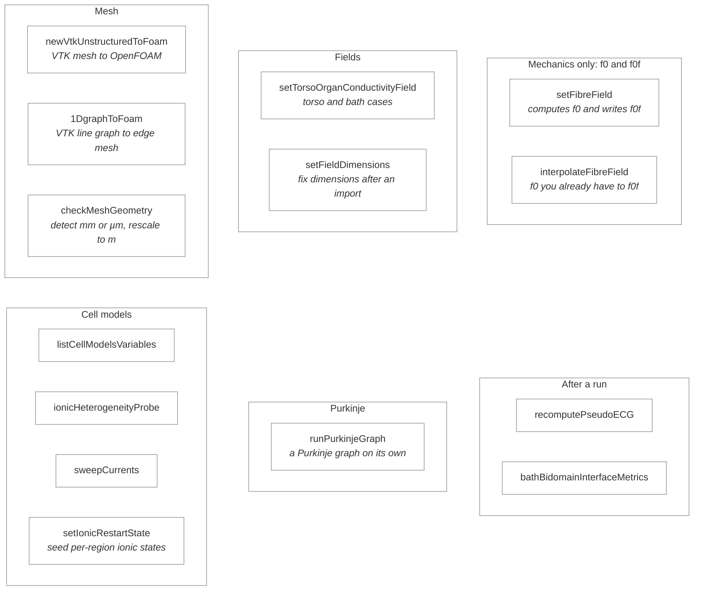

# Utilities

Fourteen tools for preparing a case before `cardiacFoam` runs, and for inspecting it afterwards.



## I need to…

| I need to… | Use | Details |
|---|---|---|
| bring in an unstructured VTK mesh | `newVtkUnstructuredToFoam` | [README](newVtkUnstructuredToFoam/README.md) |
| bring in a 1D Purkinje or line graph | `1DgraphToFoam` | [README](1DgraphToFoam/README.md) |
| check whether my mesh is in metres, and rescale it | `checkMeshGeometry` | [README](checkMeshGeometry/README.md) |
| generate rule-based fibres (mechanics only) | `setFibreField` | [README](setFibreField/README.md) |
| get `f0f` from fibres I already have (required for mechanics) | `interpolateFibreField` | [README](interpolateFibreField/README.md) |
| assign conductivity per torso organ | `setTorsoOrganConductivityField` | [README](setTorsoOrganConductivityField/README.md) |
| fix the dimensions recorded in a field file | `setFieldDimensions` | [README](setFieldDimensions/README.md) |
| see which variables a cell model exposes | `listCellModelsVariables` | [README](listCellModelsVariables/README.md) |
| check heterogeneity weights before a tissue run | `ionicHeterogeneityProbe` | [README](ionicHeterogeneityProbe/README.md) |
| start a tissue run from converged single-cell ionic states | `setIonicRestartState` | [README](setIonicRestartState/README.md) |
| sweep a cell model's currents | `sweepCurrents` | [README](sweepCurrents/README.md) |
| advance a Purkinje graph on its own | `runPurkinjeGraph` | [README](runPurkinjeGraph/README.md) |
| recompute a pseudo-ECG from saved fields | `recomputePseudoECG` | [README](recomputePseudoECG/README.md) |
| measure bath–bidomain interface fluxes | `bathBidomainInterfaceMetrics` | [README](bathBidomainInterfaceMetrics/README.md) |

## Importing an external mesh

Bringing in a mesh from GMSH, SimNIBS, Meshalyzer or a similar tool is a
three-step sequence; each step has one owner and its own README:

```bash
newVtkUnstructuredToFoam myHeart.vtk -case ./myCase   # 1. mesh + fields, source units
transformPoints -scale '(0.001 0.001 0.001)' -case ./myCase  # 2. mm to m (standard OpenFOAM)
setFieldDimensions -case ./myCase                     # 3. dimensionless -> SI dimensions
checkMeshGeometry -case ./myCase                      # confirm the result is in metres
```

See [newVtkUnstructuredToFoam](newVtkUnstructuredToFoam/README.md) for what
the import step produces, [setFieldDimensions](setFieldDimensions/README.md)
for the field-dimension catalogue, and
[checkMeshGeometry](checkMeshGeometry/README.md) for unit detection.

## Building

`applications/Allwmake` runs `wmake all utilities`, so every directory here that has a `Make/` folder builds, in both full and lightweight mode. The executable name comes from `EXE` in that utility's `Make/files`.

When you add or rename a utility, update its `Make/files`, the table on this page, its README, and any command examples that name it.
