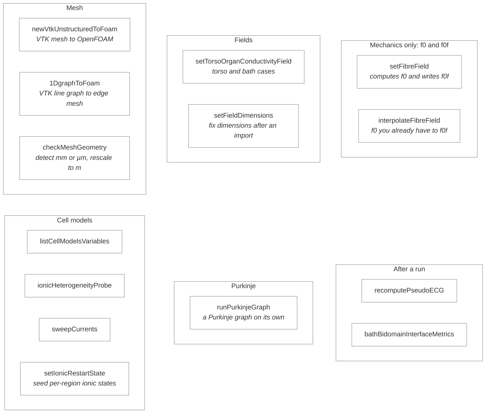

# Utilities

Fourteen tools for preparing a case before `cardiacFoam` runs, and for inspecting it afterwards.

## I need to…

| I need to… | Use | Details |
|---|---|---|
| bring in an unstructured VTK mesh | `newVtkUnstructuredToFoam` | [README](newVtkUnstructuredToFoam/README.md) |
| bring in a 1D Purkinje or line graph | `1DgraphToFoam` | [README](1DgraphToFoam/README.md) |
| check whether my mesh is in metres, and rescale it | `checkMeshGeometry` | [README](checkMeshGeometry/README.md) |
| generate rule-based fibres (mechanics only) | `setFibreField` | [README](setFibreField/README.md) |
| get `f0f` from fibres I already have (required for mechanics) | `interpolateFibreField` | [README](interpolateFibreField/README.md) |
| assign conductivity per torso organ | `setTorsoOrganConductivityField` | [README](setTorsoOrganConductivityField/README.md) |
| fix the dimensions recorded in a field file | `setFieldDimensions` | [README](setFieldDimensions/README.md) |
| see which variables a cell model exposes | `listCellModelsVariables` | [README](listCellModelsVariables/README.md) |
| check heterogeneity weights before a tissue run | `ionicHeterogeneityProbe` | [README](ionicHeterogeneityProbe/README.md) |
| start a tissue run from converged single-cell ionic states | `setIonicRestartState` | [README](setIonicRestartState/README.md) |
| sweep a cell model's currents | `sweepCurrents` | [README](sweepCurrents/README.md) |
| advance a Purkinje graph on its own | `runPurkinjeGraph` | [README](runPurkinjeGraph/README.md) |
| recompute a pseudo-ECG from saved fields | `recomputePseudoECG` | [README](recomputePseudoECG/README.md) |
| measure bath–bidomain interface fluxes | `bathBidomainInterfaceMetrics` | [README](bathBidomainInterfaceMetrics/README.md) |

## Building

`applications/Allwmake` runs `wmake all utilities`, so every directory here that has a `Make/` folder builds, in both full and lightweight mode. The executable name comes from `EXE` in that utility's `Make/files`.

When you add or rename a utility, update its `Make/files`, the two tables on this page, its README, and any command examples that name it.

Reference: build mode, source boundary and known limitations

| Purpose | Executable/runtime name | Build mode/backend | Source boundary | Known equivalence limitation | Documentation |
|---|---|---|---|---|---|
| Convert a VTK line graph to an OpenFOAM edge mesh | `1DgraphToFoam` | full + lightweight; serial | maintained C++ | Conversion preserves supported data only; validate imported topology | [README](1DgraphToFoam/README.md) |
| Detect or explicitly rescale mesh coordinates | `checkMeshGeometry` | full + lightweight; serial | maintained C++ | Detection is read-only unless writing is explicitly requested | [README](checkMeshGeometry/README.md) |
| Inspect ionic heterogeneity weights and assignments | `ionicHeterogeneityProbe` | full + lightweight; serial | maintained C++ | Diagnostic output does not replace a solver regression | [README](ionicHeterogeneityProbe/README.md) |
| List variables exposed by the selected ionic model | `listCellModelsVariables` | full + lightweight; serial | maintained C++ and generated model metadata consumer | Reports metadata; it does not prove runtime export availability | [README](listCellModelsVariables/README.md) |
| Convert an unstructured VTK mesh to OpenFOAM | `newVtkUnstructuredToFoam` | full + lightweight; serial | maintained C++ reader/converter | Conversion supports the documented VTK subset only | [README](newVtkUnstructuredToFoam/README.md) |
| Recompute pseudo-ECG output from stored fields | `recomputePseudoECG` | full + lightweight; serial | maintained C++ | Equivalence requires identical stored fields, electrodes, and settings | [README](recomputePseudoECG/README.md) |
| Advance one configured Purkinje graph domain | `runPurkinjeGraph` | full + lightweight; serial | maintained C++ | Standalone graph evolution omits myocardium coupling currents | [README](runPurkinjeGraph/README.md) |
| Create myocardial fibre/sheet fields | `setFibreField` | full + lightweight; utility-defined parallel behavior | maintained C++ | Field equivalence depends on mesh, patches, and method settings | [README](setFibreField/README.md) |
| Set field dimensions in an existing field file | `setFieldDimensions` | full + lightweight; serial | maintained C++ | Changes dimensions metadata, not field values | [README](setFieldDimensions/README.md) |
| Seed per-cell ionic restart states from single-cell states per region | `setIonicRestartState` | full + lightweight; serial and parallel | maintained C++ | Seeds ionic states only; active-tension and mechanics states are not written | [README](setIonicRestartState/README.md) |
| Assign torso-organ conductivity fields | `setTorsoOrganConductivityField` | full + lightweight; serial | maintained C++ | Result depends on input labels and conductivity dictionary | [README](setTorsoOrganConductivityField/README.md) |
| Diagnose manufactured bath-bidomain interface fluxes | `bathBidomainInterfaceMetrics` | full + lightweight; serial/reconstructed | maintained C++ | One-sided fluxes depend on the configured gradient scheme | [README](bathBidomainInterfaceMetrics/README.md) |
| Sweep configured ionic-model currents | `sweepCurrents` | full + lightweight; serial | maintained C++ and generated model metadata consumer | A sweep is not equivalent to a spatial solver trajectory | [README](sweepCurrents/README.md) |
| Face-interpolate an existing fibre field for mechanics | `interpolateFibreField` | full + lightweight; serial | maintained C++ | Reads the `f0` present and does not compute fibres; `f0f` is only used in full mode | [README](interpolateFibreField/README.md) |

Utilities are hand-maintained applications. They may consume generated ionic Names/equation metadata, but they do not own it.

