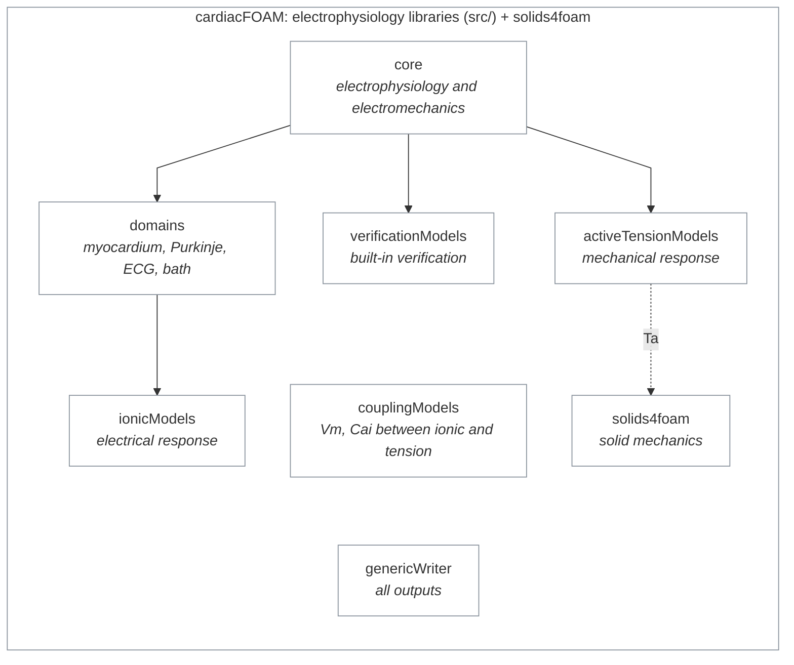

# src: the cardiacFoam libraries

cardiacFOAM combines two parts: the cardiac electrophysiology libraries in `src/`, which do not have a separate name yet, and [solids4foam](https://github.com/solids4foam/solids4foam), the solid-mechanics toolbox, included as the `modules/solids4foam` submodule. Electrophysiology runs on the `src/` libraries alone. Electromechanics is electrophysiology plus solids4foam, and the same route is meant to support fluid–structure interaction in future.

The libraries in `src/` each stand on their own: each builds and makes sense without the others, and depends only on libraries built before it. They meet in one place, the core, and exchange a few named variables.

## The core

The core covers both electrophysiology on its own and electromechanics.

- **Electrophysiology** lives in [`electroModels/core`](electroModels/core/README.md). It builds the domains a case asks for (myocardium, Purkinje network, ECG, bath), holds them in `electrophysicsSystem`, and advances them each timestep with `staggeredElectrophysicsAdvanceScheme`. Each domain that needs cell models (myocardium, Purkinje) owns one from `ionicModels`. The domains exchange data through small interfaces instead of reaching into each other's code.
- **Electromechanics** is the electrophysiology plus solids4foam. [`electroMechanicalModels`](electroMechanicalModels/README.md) owns the active-tension model, which reads `Vm` or `Cai` from the domains' cell models through `couplingModels`, and it advances the electrophysiology, then the active tension, then the solids4foam solid.

The solver, `applications/solvers/cardiacFoam`, only asks the core to advance once per timestep.

Electrophysiology uses only the libraries in `src/`. Electromechanics adds solids4foam, and the only variable that crosses to it is the active tension `Ta`. Solid arrows show what calls what; the dotted arrow is that one variable. The domains run the ionic models and the electromechanics part of the core runs the active-tension models; `couplingModels`, between them, passes `Vm` and `Cai` from one to the other. `genericWriter` is used by every library, so it has no arrows.

## Standalone modules, connected through seams

No library depends on one built after it, and no two libraries depend on each other. Where two parts need to exchange data, they do it through a small interface instead of reaching into each other's code:

- **`Vm` and `Cai`**, from the cell model to the active-tension model, through `ElectromechanicalSignalProvider` in `couplingModels`. `activeTensionModels` never includes or links `ionicModels`.
- **`Vm` and `activationTime`**, between the Purkinje network and the myocardium, through the coupling endpoints that the PVJ couplers use.
- **`phiE`**, between the bath and a bidomain myocardium, through the myocardium's domain interface.
- **`Ta`**, from the active-tension model to the solid, as a named field that the solid's constitutive law looks up.

## The modules

| Library | What it is |
|---|---|
| [`electroModels`](electroModels/README.md) | The electrophysiology part of the core, and its domains (myocardium, Purkinje, ECG, bath) with their solvers and couplers. |
| [`electroMechanicalModels`](electroMechanicalModels/README.md) | The electromechanics part of the core: it couples the electrophysiology to a solid through the solids4foam backend. Built only in full mode. |
| [`verificationModels`](verificationModels/README.md) | Built-in verification. Verifiers are chosen by `type` in the case, from the same runtime-selection tables as every other model, so a manufactured-solution check runs in the normal solver, with no special build and no hardcoded paths. |
| [`ionicModels`](ionicModels/README.md) | Cell-level models of the electrical response: 12 published ionic models, each in a scalar and a GPU-ready batched form. The myocardium and Purkinje domains each run one. |
| [`couplingModels`](couplingModels/README.md) | The link between the two kinds of cell-level model: one header through which an active-tension model reads `Vm` or `Cai` from an ionic model without depending on it. |
| [`activeTensionModels`](activeTensionModels/README.md) | Cell-level models of the mechanical response: the same kind of model as the ionic ones, driven by their `Vm` or `Cai`. The electromechanics part of the core runs them and passes the active tension `Ta` to solids4foam. |
| [`genericWriter`](genericWriter/README.md) | All the output logic: traces, ECG and Purkinje series, and anything else a case asks to write, plus reading stimuli. |

What lives inside each library, and how to use it, is on that library's own page.

## Building

Every library builds in both full and lightweight mode, except `electroMechanicalModels`, which needs solids4foam. The ionic equation headers (`<Name>_<year>.H`) are generated by [`cellML2foam`](../applications/scripts/cellML2foam/README.md): change the generator, not the generated code. `modules/solids4foam` is an external submodule.
