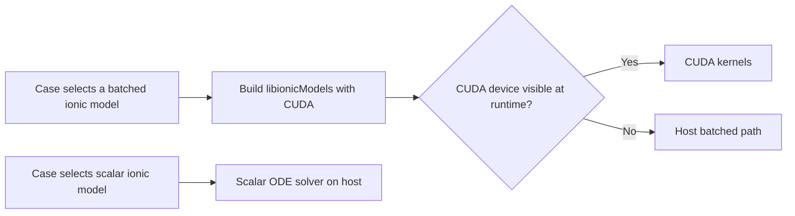

# ioniGPUKernel: batched ionic-model kernels

## Purpose

This tutorial shows how cardiacFoam's batched ionic models can run on the host
or on an NVIDIA GPU, and how to compare those paths in a small TNNP slab. The
tissue PDE remains on the CPU. The tutorial therefore measures a full coupled
cardiacFoam run, including ionic integration, CPU tissue solves, and data
transfers; it is not an isolated CUDA-kernel microbenchmark.

The GPU path is built into the batched ionic-model library. There is no separate
`cuda` dictionary switch: choose a batched ionic model, build with CUDA enabled,
and run where a CUDA device is visible. The batched model selects CUDA at
runtime and reports the selected device in the solver log.



## Build cardiacFoam with CUDA

OpenFOAM v2412 and CUDA 11.5 with GCC 10 for nvcc were used for the recorded
xenosim build. Compile with a CUDA toolkit and host compiler compatible with
the target OpenFOAM installation. CUDA does not need to be visible during
compilation; a GPU must be visible when the simulation runs.

For a clean full build, source OpenFOAM and set the CUDA build environment
before running `Allwmake`:

```bash
source /usr/lib/openfoam/openfoam2412/etc/bashrc
export CARDIAC_ENABLE_CUDA=1
export CUDA_HOME=/usr
export PATH=/usr/bin:$PATH
export LD_LIBRARY_PATH=/usr/lib/x86_64-linux-gnu:$LD_LIBRARY_PATH
export NVARCH=75
export CUDA_HOST_CXX=/usr/bin/g++-10

./Allwmake
```

If the other cardiacFoam libraries and solver are already built, rebuild the
ionic-model library with CUDA enabled:

```bash
(cd src/ionicModels && wclean libso)
(cd src/ionicModels && wmake libso)
```

`CARDIAC_ENABLE_CUDA` makes `src/ionicModels/Make/files` include
`Make/files-gpu`. `wmake` compiles each model's `.cu` source and links the CUDA
objects and runtime into `libionicModels.so`. `NVARCH=75` is the setting
recorded for the tested xenosim build, not a portable default; set the
architecture for the GPU target you are building for. The established build
environment is also described in
[`IMPLEMENTATION_AND_VALIDATION_NOTES.md`](IMPLEMENTATION_AND_VALIDATION_NOTES.md).

## What is in each ionic-model folder?

The scalar and batched implementations are paired under
[`src/ionicModels`](../../src/ionicModels/README.md):

- `src/ionicModels/<Model>/` contains the scalar C++ class, its declaration,
  and generated CellML equations and variable-name headers.
- `src/ionicModels/<Model>Batched/` contains the batched class, its declaration,
  a host/device batch equation header, and the CUDA kernel/launcher source.
- `src/ionicModels/ionicModel/` contains shared model interfaces, batched
  Structure-of-Arrays storage, integration dispatch, GPU memory/transfer code,
  and common kernel helpers.

The `.Batch.H` equations are shared by the batched host implementation and the
CUDA kernels so both backends use the same batch equations. The `.cu` file
contains the CUDA-side launch and update kernels. The scalar generated
equations remain in the scalar model folder.

| Model | Scalar folder | Batched folder | CUDA source |
| --- | --- | --- | --- |
| AlievPanfilov | [`AlievPanfilov`](../../src/ionicModels/AlievPanfilov/) | [`AlievPanfilovBatched`](../../src/ionicModels/AlievPanfilovBatched/) | `AlievPanfilovBatched_cuda.cu` |
| BuenoOrovio | [`BuenoOrovio`](../../src/ionicModels/BuenoOrovio/) | [`BuenoOrovioBatched`](../../src/ionicModels/BuenoOrovioBatched/) | `BuenoOrovioBatched_cuda.cu` |
| Courtemanche | [`Courtemanche`](../../src/ionicModels/Courtemanche/) | [`CourtemancheBatched`](../../src/ionicModels/CourtemancheBatched/) | `CourtemancheBatched_cuda.cu` |
| Fabbri | [`Fabbri`](../../src/ionicModels/Fabbri/) | [`FabbriBatched`](../../src/ionicModels/FabbriBatched/) | `FabbriBatched_cuda.cu` |
| Gaur | [`Gaur`](../../src/ionicModels/Gaur/) | [`GaurBatched`](../../src/ionicModels/GaurBatched/) | `GaurBatched_cuda.cu` |
| Grandi | [`Grandi`](../../src/ionicModels/Grandi/) | [`GrandiBatched`](../../src/ionicModels/GrandiBatched/) | `GrandiBatched_cuda.cu` |
| PerisYague | [`PerisYague`](../../src/ionicModels/PerisYague/) | [`PerisYagueBatched`](../../src/ionicModels/PerisYagueBatched/) | `PerisYagueBatched_cuda.cu` |
| Stewart | [`Stewart`](../../src/ionicModels/Stewart/) | [`StewartBatched`](../../src/ionicModels/StewartBatched/) | `StewartBatched_cuda.cu` |
| TNNP | [`TNNP`](../../src/ionicModels/TNNP/) | [`TNNPBatched`](../../src/ionicModels/TNNPBatched/) | `TNNPBatched_cuda.cu` |
| ToRORd_dynCl | [`ToRORd_dynCl`](../../src/ionicModels/ToRORd_dynCl/) | [`ToRORd_dynClBatched`](../../src/ionicModels/ToRORd_dynClBatched/) | `ToRORd_dynClBatched_cuda.cu` |
| Trovato | [`Trovato`](../../src/ionicModels/Trovato/) | [`TrovatoBatched`](../../src/ionicModels/TrovatoBatched/) | `TrovatoBatched_cuda.cu` |
| TWorld | [`TWorld`](../../src/ionicModels/TWorld/) | [`TWorldBatched`](../../src/ionicModels/TWorldBatched/) | `TWorldBatched_cuda.cu` |

Fabbri is an AV-node model. Its batched and CUDA folders implement that
single-cell model; the tissue-propagation slab below is intended for models
used as myocardial tissue models.

## TNNP 2D slab example

[`slab2D`](slab2D/README.md) is a 20 mm by 3 mm slab with 1,500 cells. The
provided batched settings are Rush--Larsen for the model's supported gates,
Euler for the remaining states, five ionic substeps, and an outer tissue
`deltaT` of 2 microseconds. The effective ionic step is 0.4 microseconds.
The scalar case uses RKF45. Keep mesh, tissue type, stimulus, tissue step,
duration, and output times fixed when comparing them.

The runtime model names in the case are `TNNP` for scalar and
`TNNPcompactBatched` for the batched implementation. The source folder is
named `TNNPBatched`; the `compact` name is a registered runtime variant.

```text
// Scalar case
ionicModel TNNP;
solver RKF45;

// Batched case (host or CUDA selected at runtime)
ionicModel TNNPcompactBatched;
batchedIntegrator rushLarsen;
batchedSubsteps 5;
```

Run the scalar and batched-host pair after a CPU-only build:

```bash
unset CARDIAC_ENABLE_CUDA
source /usr/lib/openfoam/openfoam2412/etc/bashrc
./Allwmake

python3 tutorials/ioniGPUKernel/run_slab_matrix.py \
    /tmp/tnnp-slab-cpu --models TNNP --end-time 0.015 --workers 1
```

Then build with CUDA enabled, run inside a GPU allocation, and require the
device so that a host fallback cannot be counted as a GPU result:

```bash
source /usr/lib/openfoam/openfoam2412/etc/bashrc
export LD_LIBRARY_PATH=/usr/lib/x86_64-linux-gnu:$LD_LIBRARY_PATH

python3 tutorials/ioniGPUKernel/run_slab_matrix.py \
    /tmp/tnnp-slab-cuda --models TNNP --end-time 0.015 --workers 1 --require-gpu
```

The runner writes a `summary.csv` and separate scalar and batched case
directories. In the CUDA run, confirm `batched_backend` is `GPU`; the case log
must report `using CUDA device`. To compare the two batched backend fields at
the written times:

```bash
python3 tutorials/ioniGPUKernel/slab2D/setup/post_processing_slab_field_parity.py \
    /tmp/tnnp-slab-cpu/TNNP/batched \
    /tmp/tnnp-slab-cuda/TNNP/batched
```

Use new output directories for each run. The first build/run pair measures the
scalar-to-host-batched change. The CUDA run uses the same batched equations and
integrator settings as the host-batched run, so comparing their batched rows
shows the additional CUDA effect. Scalar-to-CUDA wall-time ratio combines the
batched implementation and its fixed-step integration choices with GPU
execution; it is not a CUDA-only speedup. All reported wall times include the
CPU tissue PDE and transfers. The matrix runner times each `Allrun`, so its
case wall time also includes `blockMesh`.

## Analysis ladder: tissue step, ODE substeps, and integrator

Use the slab to answer three separate questions. The scalar `RKF45` case is the
reference. Batched full Euler is a fixed-step control. Batched
Rush–Larsen plus Euler is the main GPU path: variables whose equations have
the appropriate gate form use Rush–Larsen, while the remaining state updates
use Euler. This does not assume every state equation is Rush–Larsen eligible.

The two time controls are coupled through the effective ionic substep:
`ionic_substep = tissue_deltaT / batchedSubsteps`. Changing `deltaT` also
changes the tissue solver step; changing `batchedSubsteps` changes how often
the batched ionic ODE is advanced within that tissue step. For example, a
2 microsecond tissue step with five ODE substeps has a 0.4 microsecond ionic
substep. The sweep crosses tissue steps and substep counts, so it includes:

1. Fixed tissue `deltaT`, varying substeps: tests ionic ODE resolution while
   keeping the PDE step fixed.
2. Fixed substep count, varying tissue `deltaT`: tests the combined effect of
   a coarser PDE step and a coarser ionic substep.
3. Proportional increases in `deltaT` and substeps: keeps the effective ionic
   substep roughly fixed and helps expose effects from the tissue step.

Run the 15 ms TNNP screen in a CUDA allocation with both batched integrators:

```bash
python3 tutorials/ioniGPUKernel/run_slab_integrator_study.py \
    /tmp/tnnp-integrator-sweep \
    --models TNNP \
    --integrators euler rushLarsen \
    --dt-multipliers 1 2 5 \
    --steps 1 5 10 25 \
    --require-gpu

python3 tutorials/ioniGPUKernel/slab2D/setup/post_processing_integrator_sweep_summary.py \
    /tmp/tnnp-integrator-sweep
```

The sweep records failures as well as completed cases. It compares completed
GPU cases with scalar RKF45 at the same tissue step, a fine scalar reference,
and (when available) the fine Rush–Larsen GPU baseline. Its summary marks a
setting only as a *provisional screen pass*: activated-cell masks must differ
at no more than `max(5 cells, 1% of slab cells)`, and the 95th percentile
activation-time difference among commonly activated cells must be at most
0.1 ms at all three outputs.
Pointwise voltage RMSE is reported but does not gate the screen, because a
traveling upstroke can produce a large pointwise difference from a small timing
shift. This short screen does not establish full APD, state/current accuracy,
long-term stability, or production suitability.

To compare the three execution paths for the same chosen settings, run
`run_slab_matrix.py` once after a CPU-only build (scalar plus host-batched),
then after a CUDA build in a GPU allocation (scalar plus CUDA-batched). Use
identical model, mesh, stimulus, end time, tissue step, batched integrator, and
substep count. Compare scalar with host-batched to see the combined batching and
fixed-step integration change; compare host-batched with CUDA-batched at the
same batched settings to isolate the CUDA backend difference. Scalar-to-CUDA
timing alone does not isolate GPU acceleration.

The slab post-processing tools are documented in
[`slab2D/setup/README.md`](slab2D/setup/README.md). The field-parity tool reads
`Vm` and `activationTime` and reports voltage RMSE/max error, activated-cell
counts and mask mismatch, and activation-time p95. Its first case argument is
the reference and its second is the candidate; these can be scalar versus
batched or host-batched versus CUDA-batched.

```bash
python3 tutorials/ioniGPUKernel/slab2D/setup/post_processing_slab_field_parity.py \
    /tmp/tnnp-slab-cpu/TNNP/batched \
    /tmp/tnnp-slab-cuda/TNNP/batched
```

Slab wall time covers `Allrun`, including `blockMesh`, the CPU tissue solve,
ionic updates, and host/device transfers. Record the GPU model, CPU allocation,
compiler/toolkit, mesh, simulated duration, and exact integrator settings with
any performance result. Treat GPU-kernel timing as a separate measurement if
the goal is to isolate kernel throughput.

## More implementation and run records

- [`slab2D/README.md`](slab2D/README.md): case details and model-matrix commands.
- [`VALIDATION_STATUS_2026-09-28.md`](VALIDATION_STATUS_2026-09-28.md): per-model
  backend parity and recorded run limits.
- [`IMPLEMENTATION_AND_VALIDATION_NOTES.md`](IMPLEMENTATION_AND_VALIDATION_NOTES.md):
  implementation details, integration controls, timing records, and validation
  history.
