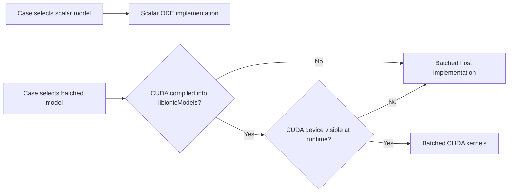

# monodomainBatchedGPUParity - monodomainPseudoECG

## Purpose

This study checks the batched manufactured monodomain ionic model against the
scalar reference and checks that its host and CUDA backends produce consistent
results. It reuses the `monodomainPseudoECG` tutorial case and its manufactured
solution verifier. The verifier measures errors in `Vm`, `u1`, and `u2`; the
case dictionary selects which ionic-model implementation is being exercised.

The scalar model is the numerical reference. The batched model has a CPU path
and, when built with CUDA support and run with a visible NVIDIA device, a CUDA
path. The CUDA path is selected at runtime by the batched model; it is not a
separate ionic-model name.

## Backend selection



The CUDA source files are included in the `libionicModels` build when
`CARDIAC_ENABLE_CUDA` is set. `wmake` compiles them with the CUDA toolchain and
links the resulting code and CUDA runtime into `libionicModels.so`. The GPU
does not need to be visible on the build host, but a GPU must be visible to the
simulation process for the CUDA path to run. Without one, the batched model
falls back to its host implementation.

## Build

With the standard CPU build, the scalar and batched host implementations are
available. From the repository root:

```bash
source /usr/lib/openfoam/openfoam2412/etc/bashrc
./Allwmake
```

To build the CUDA kernels into `libionicModels.so`, use a CUDA toolkit and host
compiler compatible with the selected OpenFOAM installation. The following is
the configuration recorded for the xenosim OpenFOAM v2412 build (CUDA 11.5,
GCC 10 for nvcc, RTX 4000 Ada):

```bash
source /usr/lib/openfoam/openfoam2412/etc/bashrc
export CARDIAC_ENABLE_CUDA=1
export CUDA_HOME=/usr
export PATH=/usr/bin:$PATH
export LD_LIBRARY_PATH=/usr/lib/x86_64-linux-gnu:$LD_LIBRARY_PATH
export NVARCH=75
export CUDA_HOST_CXX=/usr/bin/g++-10

(cd src/ionicModels && wclean libso)
(cd src/ionicModels && wmake libso)
```

`NVARCH=75` records the tested build setting; choose and verify an architecture
appropriate for the target GPU when building elsewhere. For a clean full build
instead of rebuilding only the ionic-model library, run `./Allwmake` from the
repository root with the CUDA environment set.

## Run and confirm the backend

The study cases use the same mesh, tissue settings, manufactured verifier,
time-coupling scheme, and output times when comparing implementations. Select
the implementation in `constant/electroProperties`:

```text
// Scalar reference
ionicModel monodomainFDAManufactured;

// Batched model; configure these for the study being run
ionicModel monodomainFDAManufacturedBatched;
batchedIntegrator euler;
batchedSubsteps 25;
```

Run the CUDA case on a node or allocation with an NVIDIA GPU assigned and
visible to the process. Confirm that `log.cardiacFoam` contains a line like:

```text
monodomainFDAManufacturedBatched: rank 0 using CUDA device 0 of 1
```

A warning that no CUDA device is visible means the batched host fallback ran;
that run is not a CUDA result. Keep scalar, batched-host, and batched-CUDA
outputs in separate case directories so their logs, dictionaries, and
manufactured error summaries remain attributable to the correct implementation.

## Interpretation

The verifier reports errors against the analytic manufactured solution. This
tests numerical convergence; it does not require pointwise equality between
the scalar RKF45 trajectory and a batched Euler trajectory. Backend parity
compares CPU-batched and CUDA-batched runs with identical equations and
integration settings. Record the tissue `deltaT`, ionic substeps, coupling
scheme, mesh, and backend with every result.

This small manufactured model is intended for correctness and convergence
checks, not as a representative GPU performance benchmark.

## Outputs

Keep generated meshes, solver logs, fields, and metric tables in a local,
git-ignored results directory. Commit the study configuration and analysis
scripts, not generated OpenFOAM case output.
